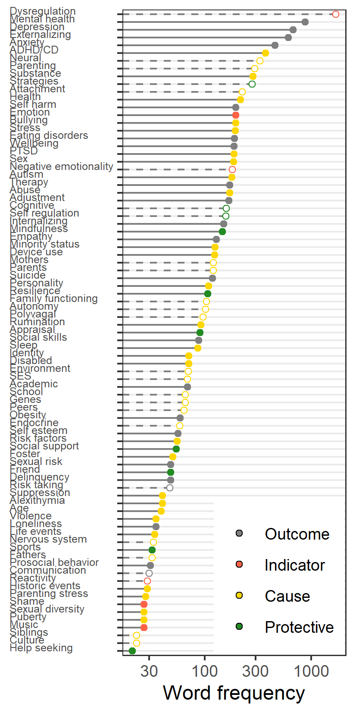
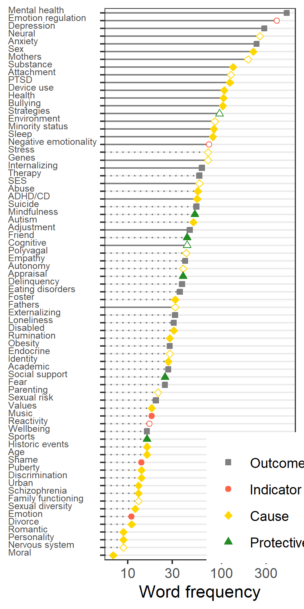

```{r setup, include = FALSE}
library("papaja")
library(bibliometrix)
library(revtools)
library(bib2df)
library(knitr)
library(kableExtra)
library(cowplot)
run_everything = FALSE
notingraph <- list()
```
<!-- Reviewer suggestions:
Kristin Buss -->

```{r analysis-preferences}
# Seed for random number generation
set.seed(42)
knitr::opts_chunk$set(cache.extra = knitr::rand_seed)
```

<!-- Development and Psychopathology is the most relevant source of articles reviewed herein
Most Relevant Sources

                                                       Sources        Articles
1  DEVELOPMENT AND PSYCHOPATHOLOGY                                         120

on adolescent emotion regulation development is limited27–29. The field is therefore at an impasse: We know that some adolescents are more susceptible to emotion dysregulation than others, but lack tools and theory to identify important predictors of individual development30.
--> 

<!-- Emotion regulation in adolescence is important -->
A key developmental challenge in adolescence is acquiring mature emotion
regulation skills [@croneUnderstandingAdolescencePeriod2012;
@zimmermannEmotionRegulationEarly2014]. Emotion regulation is integral to
mental health [@aldaoEmotionregulationStrategiesPsychopathology2010;
@schaferEmotionRegulationStrategies2017; @braetEmotionRegulationChildren2014]
and social functioning [@reindlSocializationEmotionRegulation2016]. For as many
as one in five individuals, adolescence marks the onset of emotion
regulation-related mental illness, which can persist throughout the life course
[see @leeAdolescentMentalHealth2014]. 
It is therefore crucial to identify which
risk factors and environmental hazards render some adolescents more susceptible
to emotional difficulties than others. <!--SH: Main goal of paper -->
Although there is an abundance of empirical work on adolescents' emotion regulation, the literature is somewhat fragmented, because the topic has been investigated from different (sub)disciplines.
As a result, there is a lack of unifying theory,
and intrinsic limitations of narrative reviews prohibit comprehensive coverage of the vast but diffuse literature [@bussTheoriesEmotionalDevelopment2019].

The present systematic review seeks to overcome these limitations by adopting a novel method:
the text mining based systematic review.
We set out to map the constructs associated with adolescent emotion regulation based on a systematic review of the empirical literature.
Traditional narrative literature reviews have been shown to be marred by reliance on small convenience samples of the literature, confirmation bias,
and an undue emphasis on positive results [@littellEvidencebasedBiasedQuality2008]. 
Text mining, by contrast, is uniquely suited to provide a comprehensive overview of the literature.
It can cover vastly greater corpora than a human reader,
and the process by which text mining gleans insights from the literature is more objective, transparant, and reproducible.
Where human readers might be inclined to structure their reading of the literature around established ideas,
the inherent "fairness" of text mining gives emerging themes in the literature a chance to come to the fore.
Text mining identifies important topics in a body of literature and reveals which constructs are often studied together.
This potentially reveals topics and connections missed by narrative reviewers,
thereby laying the groundwork for future empirical and theoretical work. <!-- CJ To fill out gaps, following up on promising constructs and unify heretofore disparate regions of the lit -->
<!-- SH: this implies that the main contribution of the paper is predominantly methodological is that the case? Is there some primary thesis/argument that will be advanced? It is really important to take a top-down approach to that messaging, beginning here in the first paragraph-->
<!-- Ergens anders: Similarly, although
there are several *relevant* theories, there is no specific theoretical
framework to guide research on adolescents' emotion regulation. Although theory
development is beyond the scope of this paper, we set out to generate a
proto-theoretical nomological network of the potential risk factors,
manifestations, and outcomes of emotion regulation in adolescence. We discuss
how this nomological network relates to existing relevant theory, and conclude
with recommendations for future theory-generating efforts.-->

## Why adolescence is an important life stage for emotion regulation

Adolescence is defined as a life stage ranging from pubertal onset to
adult-like independence [@steinbergAgeOpportunityLessons2014].
It is thus demarcated by both biological and socio-cultural factors.
It has been argued that,
due to accellerated pubertal onset and delayed transitions to adult roles,
adolescence now ranges from 10-24 years in the modern Western world
[@sawyerAgeAdolescence2018].
<!-- From Barriola:
* adolescence, more than adulthood or childhood, is characterized by frequent
and intense emotions (Larson et al. 1980; Larson and Lampmanpetraitis 1989).
* signi?cant psychosocial changes that call for an increase in sophistication
of ER strategies (Steinberg 2005)
* novel stressors associated with social relationships, including pressures to
conform to adult expectations relating to maturity, educational achievement,
gender appropriate conduct, and other socially competent behaviors (Yap et al.
2007)
* Additionally, adolescents have an increased orientation toward autonomy
(Spear 2000) including autonomous emotional regulation-->
Adolescence is increasingly seen as a developmentally sensitive period for
mature emotion regulation skills. During this period, children experience rapid
biological, cognitive, and social changes that prompt new emotional
experiences, and tax existing regulatory abilities
[@steinbergAgeOpportunityLessons2014]. At the same time, the staggered
development of motivational-emotional and regulatory brain circuits gives rise
to a maturity gap [@croneUnderstandingAdolescencePeriod2012]. 
This leads youngsters to pursue new experiences in life and love,
without being fully prepared to cope with the emotional outcomes.
Due to these coalescing changes,
adolescents display a restricted repertoire of emotion regulation strategies
compared to younger or older individuals
[@zimmermannEmotionRegulationEarly2014]. Consequently, adolescents experience
more frequent and intense (negative) emotions than children or adults [see
@silkAdolescentsEmotionRegulation2003]. The literature thus paints a picture of
adolescence as a chrysalis for emotional development: Children enter this stage
with emotion regulation skills adapted to the challenges of childhood. During
adolescence, emotional systems are rearranged substantially. These changes
render adolescents temporarily vulnerable to emotional dysregulation, but
ultimately serve a functional role in acquiring mature emotion regulation
skills. Eventually, most adolescents emerge ready to take on the challenges of
early adulthood. Unfortunately, a sizeable proportion of adolescents instead
manifests enduring emotional difficulties [@leeAdolescentMentalHealth2014].

<!--
* intense negative emotions in daily life (Silk, Steinberg, & Morris, 2003) 
* unstable peer or romantic relationships (Furman & Collins, 2009)
* decrease in perceived support from parents (Furman & Buhrmester, 1992).
* early adolescence is characterized by a higher rate of conflicts with parents (Laursen, Coy, & Collins, 1998)
* higher variability of negative emotions compared to late adolescence (Larson, Moneta, Richards, & Wilson, 2002).
* relative to other developmental stages, adolescence involves a particularly large number of transitions, novel situations, and new stimuli, physical, cognitive, emotional, and social development—particularly in early and mid-adolescence (Seiffge-Krenke, 2000)
-->

## The consequences of difficulties in emotion regulation

<!--Acquiring mature emotion regulation abilities is important, because t-->The
consequences of difficulties in emotion regulation are extensive,
well-documented, and persist throughout the life course. Meta-analyses indicate
that such difficulties are associated with internalizing, and to a lesser extent, externalizing, psychopathology
[@aldaoEmotionregulationStrategiesPsychopathology2010;
@schaferEmotionRegulationStrategies2017]. 
Individuals who engage in maladaptive
emotion regulation strategies also experience more negative emotions,
diminished well-being, and greater strain in interpersonal relationships
[@grossIndividualDifferencesTwo2003a; @bellRelationshipsInputsOutputs2000].
<!--Adolescence also appears to be a key period for developing mature emotion
regulation skills - but not all adolescents do so successfully. As many as one
in five adolescents instead develop severe emotional difficulties.--> 
Given the
prevalence of emotional difficulties and their implications for
individual mental health, wellbeing, and social functioning, and their downstream
cost to society as a whole [@leeAdolescentMentalHealth2014], it is essential to
have a solid understanding of the risk factors associated with adolescents'
emotion regulation difficulties.

## Existing theoretical landscape

The results of our text mining analysis of the empirical literature are best understood against a backdrop of the existing theoretical landscape.
We therefore provide a summary theoretical review.
Other recent publications offer more detailed reviews of theories of emotional development [@bussTheoriesEmotionalDevelopment2019] and emotion regulation in adolescence [@riedigerEmotionRegulationAdolescence2014].
The correlates of emotion regulation difficulties discussed in the theoretical review below
are visually summarized in the left panel of Figure \@ref(fig:baseline)^[Based on an author-curated list of keywords, caterogized using the dictionary method introduced in Analysis 1.].

```{r baseline, warning=FALSE, eval = TRUE, out.width = "100%", fig.cap="Correlates of emotion regulation difficulties according to theory (left panel) and narrative reviews (right panel). Transparent circles indicate constructs also represented in the theory."}
knitr::include_graphics("baseline_network.png") 
#fig_svg <- cowplot::ggdraw()+cowplot::draw_image("s1_varimp.svg")
#plot(fig_svg)
keyw <- function(x){
  cat(x)
}
```

Among the oldest relevant theories of adolescents' emotional development is Hall's notion of "storm and stress" [see
@arnettAdolescentStormStress1999]. It describes how `r keyw("hormonal")` changes diminish
`r keyw("self-control")` and increase `r keyw("reactivity")`, leading to difficulties in emotion
regulation, `r keyw("conflict with parents")`, and `r keyw("risky behavior")`.
In modern theories, this notion of diminished self-control and increased emotional reactivity has been retained - although it is now considered to be a normative change that facilitates emotional maturation
[@croneUnderstandingAdolescencePeriod2012], at the risk of emotional
disturbance [@arnettAdolescentStormStress1999; @leeAdolescentMentalHealth2014].

<!--SH I am still not sure what the empirical contribution is - can you be more specific with it in this sentence? -->
<!--Several recent publications have undertaken the
monumental task of providing a comprehensive overview of theories of emotional
development [e.g., @bussTheoriesEmotionalDevelopment2019;
@holodynskiDevelopmentEmotionsEmotion2006;
@riedigerEmotionRegulationAdolescence2014], and of the empirical work
pertaining to emotions in adolescence
[@coe-odessEmergentEmotionsAdolescence2019].  -->

One example of a normative theory of emotional development in early childhood is presented by Sroufe [-@sroufeEmotionalDevelopmentOrganization1995].
Sroufe argues that, as children grow older,
their increasing `r keyw("self-regulatory")` abilities
drive a transition from external emotion regulation by `r keyw("primary caregivers")`
towards autonomous emotion regulation. This theory focuses on two drivers of
development: `r keyw("social")` and `r keyw("cognitive influences")`. Social influences mainly occur
through `r keyw("parental co-regulation")`, `r keyw("parenting behaviors")`, and parent-child
`r keyw("attachment")`. Cognitive influences occur through the development of the `r keyw("central
nervous system")` (CNS), `r keyw("cognition")`, and `r keyw("self-regulation")`.

This emphasis on social influences and `r keyw("neurocognitive development")` is reflected in many theories.
Some of these focus primarily on neurocognitive development.
For example, `r keyw("polyvagal theory")` closely links `r keyw("emotional experience")`
- and regulation - to autonomous nervous system functioning
[@porgesOrientingDefensiveWorld1995].
A more recent neurocognitive theory relevant to adolescents' emotion regulation development is Crone
and Dahl's model of social-affective engagement and `r keyw("goal flexibility")`
[@croneUnderstandingAdolescencePeriod2012]. Like other authors 
[e.g., @caseyBrakingAcceleratingAdolescent2011; @craccoEmotionRegulationChildhood2017],
Crone and Dahl argue that the developmental
asymmetry between `r keyw("motivational")` and inhibitory `r keyw("brain")` circuits gives rise to a
"maturity gap" in middle adolescence. 
What distinguishes Crone and Dahl from related writings
is the greater attention to adolescents' diverging destinies:
the question why some youngsters flourish while others languish.
They argue that adolescents' cognitive engagement is dynamically responsive to
social and motivational `r keyw("goal salience")`. This flexibility, on the one hand,
prepares adolescents to effectively engage cognitive systems in novel
challenging situations in a way that facilitates developing mature regulatory
abilities. On the other hand, it places them at risk to act impulsively in
pursuit of `r keyw("peer approval")`. In terms of explanans,
this theory focuses primarily on cognitive factors
and the role of peers, with less attention to factors such as parenting.
Although this theory focuses on adolescence specifically,
an important limitation is that it only tangentially relates to emotion regulation.

Other theories emphasize socialization to a greater extent.
One such theory is Morris' tripartite model, which focuses specifically on `r keyw("parents")`' role in emotion regulation development [-@morrisRoleFamilyContext2007].
It describes three pathways through which parents shape emotion regulation
development: Through observation and `r keyw("modeling")`, `r keyw("parenting practices")`, and the
emotional `r keyw("family climate")`, which in turn involves attachment and `r keyw("marital
relationship")` quality. Morris and colleagues emphasize the relevance of `r keyw("mothers")`, 
`r keyw("fathers")`, and siblings.
Others have adapted the tripartite model to describe
the role of peers in adolescents' emotion regulation development
[@reindlSocializationEmotionRegulation2016].
A more abstract take on socialization is found in @holodynskiDevelopmentEmotionsEmotion2006's
internalization model of emotional development. 
Unique aspects emphasized in this theory are the interplay between emotion and `r keyw("communication")`,
and the internalization of the `r keyw("cultural")` symbolic function of emotion.
These theories explain the process of socialization in great detail,
but one potential limitation is that they are not embedded in a larger unifying framework.
<!--Like Sroufe, Holodynski describes an age graded transition from
interpersonal to intrapersonal emotion regulation.
In doing so, Holodynski applies Vygotsky's theory of development to the domain of
emotion, and presents a detailed integrated model of emotional experience and
regulation.-->

Looking beyond the developmental literature,
theories of the phenomenon of emotion regulation offer additional insight into
intra-individual drivers of emotion regulation development.
Perhaps the most influential theory is Gross'
[-@grossHandbookEmotionRegulation2013] process model, which describes the
process of emotion regulation from eliciting cue to ultimate response.
According to Gross, individuals use `r keyw("strategies")` to modulate the different stages of this process,
consciously or otherwise. `r keyw("Culture")` plays a role too, as the effectiveness, desireability, and consequences of different strategies depend on the social context [see
@bariolaChildAdolescentEmotion2011]. Similar to Gross' theory, the social
information processing theory of emotion also describe the role of cognitive
processes and strategies in emotion experience and regulation
[@lemeriseIntegratedModelEmotion2000].

Finally, given our interest in risk factors that render adolescents susceptible
to emotional difficulties, we should mention two theories widely invoked to frame research on developmental influences: Bronfenbrenner's bioecological model, and Sameroff's
transactional model.
Bronfenbrenner's model
[@bronfenbrennerBioecologicalModelHuman2007] describes how the `r keyw("environment")`
shapes individual development. Each individual is imbued with certain
`r keyw("biological")` predispositions, and develops over time, in interaction with
contextual influences. These influences range from the microsystem, composed of
those people close to the individual, to the macrosystem, consisting of
indirect `r keyw("political")` and `r keyw("economic")` influences, to the exosystem, consisting of
cultural norms and values. Sameroff's model is somewhat compatible with the
bioecological model [@sameroffUnifiedTheoryDevelopment2010], but focuses more
on the interplay between nature and nurture. It conceptualizes development as a
product of reciprocal influences between the child and the environment.
Sameroff distinguishes between proximal influences, for instance, through
parents (the microsystem in Bronfenbrenner's model), and distal influences;
structural factors indirectly shaping development, like socio-economic status,
`r keyw("schools")`, and the `r keyw("community")` (macro- and exosystem). With increasing age, distal
influences gradually gain ground on proximal influences.
These theories are broad enough to contextualize any developmental study,
but lack specificity, which curtails their utility in generating hypotheses.
<!-- RK: What do you take from these broad perspectives for your RQ?-->
<!--SH I am not sure what contribution this paragraph ultimately makes - you should consider condensing it substantially to just note that these theories have something to say about emotional development but are not adolescent-specific-->
<!--Theories like this are particularly relevant to a fine-grained
understanding of the process of emotion regulation, but their developmental
relevance has unfortunately not yet been considered (REF Buss). -->
<!--Parents are widely considered to be the primary proximal influence driving
emotion regulation development.
Yet several limitations remain.
@coe-odessEmergentEmotionsAdolescence2019;
instead takes an inductive approach to map the correlates of adolescents'
emotion regulation based on all available literature.

The present study instead takes an inductive approach to map the correlates of
adolescents' emotion regulation based on all available literature. From this
mapping, we proceed to classify correlates as potential risk factors,
manifestations, and outcomes of adolescent emotion regulation. The results
provide a conceptual overview of the existing literature, can help identify
blind spots in existing theory, and might inspire new hypotheses to guide
future deductive research.

Several limitations emerge from prior efforts to provide an encompassing
framework of this literature

These efforts at unification have, thusfar, been conducted in a top-down,
theory-driven manner.

which motivates most youngsters to seek out challenges in life and love, but
renders some of them vulnerable to emotion dysregulation.  -->

<!--
Note that the left panel of Figure \@ref(fig:baseline) visually summarizes the correlates of emotion regulation difficulties (labeled: *Dysregulation*) according to our theoretical review.
The left panel of Figure \@ref(fig:baseline) summarizes key constructs covered by the theories reviewed above. 
In the subsequent text mining analysis, we will distinguish the topics covered in this theoretical review visually to highlight unique contributions of our approach.
This allows us to see in what respects the text mining analysis reflects existing theory,
and in what respects it complements it.-->


### Shortcomings of existing theory

Despite the abundance of theory *relevant* to emotion regulation in adolescence,
the theoretical literature has several limitations.
First, few theories have explicitly addressed the life stage of adolescence. This life stage differs qualitatively from infancy, childhood, and adulthood [@bariolaChildAdolescentEmotion2011].
It is therefore questionable whether more general theories, or those focused on different age groups, can be generalized to adolescents.
<!--Relatedly, many relevant theories lack an explicit developmental component, which renders them and thus lack a well-substantiated
understanding of developmental processes[see
@bussTheoriesEmotionalDevelopment2019;
@croneUnderstandingAdolescencePeriod2012]. -->
Furthermore, few theories have comprehensively addressed important predictors of development in this life stage,
and none directly guide contemporary research in the field [see @bussTheoriesEmotionalDevelopment2019; @riedigerEmotionRegulationAdolescence2014].
Finally, available theories vary widely in scope:
Some are broad but somewhat non-specific, and others describe a specific phenomenon in detail,
but lack a broader perspective.
It would be beneficial to bridge these levels of analysis.
In sum, there is a need for more integrative theory formation,
in order to provide a unified framework that could guide future empirical work.<!--[see @riedigerEmotionRegulationAdolescence2014].
Inductive analysis of the empirical literature may constitute a first step to this end.-->
<!--Such a theory should focus on -->
The present study lays the groundwork for such theory development,
by providing a text-mining based inductive systematic review of the field.


<!--
Barriola: What is most
* evident from the reviewed studies is that the samples
investigated have been mainly non-clinical, within the
early childhood period of development and have examined
predominantly maternal socialization factors.
* the vast
majority have been restricted to toddlers and young chil-
dren and have only examined the in?uence of maternal,
and not paternal, expression.
Most of the literature has addressed emotion regulation in adult or infant
samples. A smaller, but substantial, portion of the literature has examined
emotion regulation in adolescents.
-->

<!-- Next paper: * Existing theory is not very specific, in the sense that it
can give rise to concrete, testable predictions. "either is not guided by
hypotheses of an explicit theory or cites a theory but does not explicitly test
the theory." (Buss) (Smaldino)-->
<!--Unfortunately, there is little theory about which risk factors and
environmental hazards render adolescents susceptible to emotional
difficulties11-->

<!--Initially, much of the research on emotion regulation focused on either
adulthood or early childhood. In recent years, however, a substantial body of
research on emotion regulation in adolescence has accrued.-->

<!--What are the predictors of emotion regulation in adolescence?-->

<!--Emotion regulation can be defined as the ability to modulate emotional
experience and expression through automatic or deliberate processes. -->


<!--


## Why focus on theory?


A focus on theory is becoming increasingly important, given the concern about
the replicability of social scientific findings [@KLEIN].

Several authors of comprehensive reviews have noted that developmental theories
of emotion are still in their infancy [@bussTheoriesEmotionalDevelopment2019].
Several specific limitations of the theoretical landscapes precipitate the
present study. First, although there are many *relevant* theories, few are
focused specifically on emotion regulation. Second, the stage of adolescence is
rarely addressed, although empirical research has indicated that this is a
crucial period of emotion regulation development.
"emotion theory has largely focused on adults, and emotional development theory
has largely focused on infancy and early childhood (see Chap. 24 on adolescent
emotional development)." Buss et al 2019:20

## Why inductive -->

## Prior narrative reviews

Whereas theory provides a top-down frame of reference for understanding a phenomenon,
literature reviews can provide a bottom-up, inductive understanding.
Given the noted absence of a single overarching theory, reviews might provide additional
insight into factors considered relevant in the etiology of adolescents'
emotion regulation competencies. 
Innovative text mining methods are promising in this respect, because they can comprehensively review the available literature.
Narrative reviews, however, constitute the status quo.
We will therefore examine how two excellent narrative reviews on emotion regulation in adolescence complement the aforementioned theoretical literature [@coe-odessEmergentEmotionsAdolescence2019; @bariolaChildAdolescentEmotion2011].
The right panel of Figure \@ref(fig:baseline) visually distinguishes constructs  uniquely covered by these narrative reviews,
relative to the issues also addressed in the theoretical literature (left panel).

<!--
Note that the left panel of Figure \@ref(fig:baseline) visually summarizes the correlates of emotion regulation difficulties (labeled: *Dysregulation*) according to our theoretical review.
The left panel of Figure \@ref(fig:baseline) summarizes key constructs covered by the theories reviewed above. 
In the subsequent text mining analysis, we will distinguish the topics covered in this theoretical review visually to highlight unique contributions of our approach.
This allows us to see in what respects the text mining analysis reflects existing theory,
and in what respects it complements it.-->

The seminal review by
@bariolaChildAdolescentEmotion2011 addresses individual psychological factors
such as temperament, and biological factors like neurocognitive development and
genetic predispositions. Furthermore, the authors address proximal social influences,
including parents, teachers, and peers, and specific mechanisms through which
these individuals exert their influence, including parenting and modeling.
Finally, they address distal factors, including the role of culture and the
media. Barriola and colleagues also 
<!--most notably, they call for a robust theoretical framework to guide future
research.--> call for future research to address parents' role beyond early
childhood.
They further argued that the role of fathers in emotion socialization warrants further scrutiny - a topic that is now receiving more attention [e.g., see @vanlissaRoleFathersMothers2019;
@vanlissaMothersFathersQuantitative2020].

A more recent review by @coe-odessEmergentEmotionsAdolescence2019 offers a nuanced
discussion of several issues that complement prior publications in this field.
For instance, the authors cover the implications of physiological changes in
detail, including neurocognitive development and pubertal maturation. As
adolescents become increasingly individuated, conflict with parents peaks. This
conflict, in turn, impacts emotion regulation, both in terms of day-to-day mood
variability and dispositional emotion dysregulation [see also
@vanlissaCostEmpathyParentadolescent2017].
Compared to children, adolescents also become increasingly oriented towards peers.
This includes increased
sensitivity to social status and norms, along with the associated increase in
peer pressure and risk taking. Pubertal development also initiates the
emergence of sexual and romantic behavior, and the intensification of both
biological sex differences and gender stereotyped behavior. With regard to the
process of emotion regulation, Coe-Odess and colleagues discuss the importance
of strategies, and point out that, in addition to negative emotionality,
positive emotionality also peaks in adolescence. Relatedly, the authors
describe how hormonal changes precipitate an increased stress response, which
might help explain adolescents' greater susceptibility to emotion
dysregulation. Finally, going beyond the implications of cognitive development
discussed in other publications, the authors discuss how an greater capacity
for abstract thought relates to identity formation - a key challenge in
adolescence [@meeusStudyAdolescentIdentity2011] - and to increased emotional
understanding, and by extension, empathy [see also
@vanlissaLongitudinalInterplayAffective2014].

As can be seen in Figure \@ref(fig:baseline), 
there are notable parallels between the relevant factors highlighted by these
narrative reviews, and the aforementioned theoretical literature.
Nevertheless,
these literature reviews also touch upon issues that have received little
attention in theoretical work.
These include specific individual differences at the biological and psychological level, including genetic predisposition, hormones, pubertal onset, gender, sexuality, temperament, identity, empathy, and stress.
Further introduced are proximal influences, including the role of media, norms, and social status.
This illustrates that reviews of the empirical literature can contribute additional insight into key factors in adolescents' emotion regulation development.
However, an important remaining limitation is that all reviews in this field have been unstructured narrative reviews, which are known to be limited in scope and biased [@littellEvidencebasedBiasedQuality2008].
We seek to complement preceding work by using text mining to conduct a more comprehensive empirical
literature review, and map the factors associated with adolescent emotion
regulation.

<!-- NIET TEVEEL OVER THEORIE PRATEN; IK KIJK NIET NAAR THEORIE. IK KIJK NAAR FACTOREN DIE IN VERBAND GEBRACHT WORDEN MET EMOTIEREGULATIE. -->
<!--The life stage of adolescence differs qualitatively from both childhood and adulthood. It is therefore not sufficient to extend -->

<!--
Influences on emotion regulation (Riediger Klipker)
* Neurophysiological development 
* Familial context


Despite widespread interest in emotion regulation in adolescence, there is a lack of explicit theories about which risk factors and environmental hazards render adolescents susceptible to emotional difficulties. Some theories can be considered relevant, but these theories are rarely explicit enough to generate specific predictions. 
As many as one in five adolescents experiences severe emotional problems. A key question is therefore which factors render adolescents at-risk for difficulties in emotion regulation. 

Unfortunately, relevant theory on adolescent emotion regulation development is limited27–29. The field is therefore at an impasse: We know that some adolescents are more susceptible to emotion dysregulation than others, but lack tools and theory to identify important predictors of individual development30.

inductive approach, thereby facilitating a more complete understanding of developmental processes, and nourishing theory formation

My work addresses this lacuna by taking an inductive approach to theory formation; paying special attention to between-person differences. This paves the way for a new wave of person-centered research


Key questions:

Why focus on emotion regulation specifically, instead of other aspects of emotional development?

* Biological determinants
* Social determinants

* Existing developmental theories do not focus on adolescence (rather, on adults, or development in infancy and childhood). However, many interesting emotion-related things happen in adolescence.

Important:
Buss: theories of emotion and emotional development
Cracco: Evidence for a maladaptive shift in emotion regulation in adolescence
Zimmermann & Iwanski: Dip in adolescence

Sroufe 1995: Development of emotion regulation until preschool age
"the key progression in emotional regulation is from caregiver-orchestrated
regulation to dyadic regulation to self-regulation."
* attachment - dyadic regulation of emotion (Sroufe 1996)
* Caregiver-guided self-regulation 
* Autonomous self-regulation
***** HOWEVER: In adolescence, regulatory brain regions still developing!!!! So Sroufe stops too early

Polyvagal theory Porges 1995 -->

<!-- SH: ultimately I think that the introduction is too long - considering that the introduction, itself, is a literature review to some extent, I don't come away with a clear delineation between the literature review up this point and the new work you are going to contribute. I think you need to review the Introduction with an eye on focusing the discussion on the problems/gaps that exist and how the lit review method usually used are insufficient for addressing those issues-->

## The present paper

The present paper aims to develop a nomological network of the constructs
related to adolescent emotion dysregulation, based on a systematic review of
the literature. A nomological network is a diagrammatic representation of a
phenomenon; a proto-theoretical device that describes relationships between
constructs relevant to the theory [see @alaviAligningTheoryMethodology2018].
It is a precursor to a more
explicit theory of the phenomenon. The present paper uses an inductive approach
to develop this nomological network. <!-- CJ Consider removing the following if the purpose is sufficiently clarified in the introduction -->
First, we conducted a systematic search to
elicit a corpus of relevant literature. Second, we used text mining techniques
to extract relevant constructs from the corpus. Third, we used a dictionary to
pare down the extracted constructs to meaningful superordinate categories.
Fourth, we mapped interrelations between these constructs. Fifth, we classified
contstructs as potential predictors or outcomes.
<!--, and we categorize predictors
by level of analysis-->
<!-- (CJ: Sameroff, which level of biopsychosocial)-->.
<!-- t, using text mining to map potential predictors of adolescent emotion
dysregulation.
identify relevant constructs of adolescents’ emotion regulation development,
and moderators of parents’ role therein. The resulting insights are
consolidated into theory.
The present study intends to map the extant literature
First, I will systematically review predictors currently considered relevant in
the adolescent emotion regulation literature.  -->

# Methods

## Search strategy

All searches were conducted on Web of Science,
the most comprehensive database for which we had permissions for exporting keywords and abstracts.
The search strategy was based on
procedures described by Staaks [@staaksSystematicReviewSearch]. First, we
manually constructed a reference set of 15 articles. Then we constructed a
search string to retrieve these articles from Web of Science. The search was
overly inclusive, returning 29 records.
As these were all highly relevant, we
updated the reference set to include all 29 results.
Next, we tested our search string, which consisted of synonyms of emotion regulation and adolescence: <!--
### Reference set Our reference set is documented in `reference_set.bib`. -->
```
TS=("emotio* regulation" OR "anger regulation" OR "sadness regulation" OR
"emotion* competence" OR "emotion* adjustment" OR "emotio* dysregulation" OR
"anger dysregulation" OR "sadness dysregulation" OR "emotio* problem*" OR
"emotion* maladjustment") AND TS=(adolescent* OR teen* OR pubert* OR youth)
```
This string returned 6653 results, and matched 25 of the 29 records in the
reference set. To match all 29 reference set items,
three additional terms would have to be added to the search string.
Adding the terms `"emotio* socialization" OR "emotio* processes"`, as synonyms for emotion regulation,
would result in 191 more hits, most of which did not meet the inclusion criteria used for screening, as explained below.
Adding the term `"development*"`, as synonym of adolescence, added 3628 new hits,
many of which were not focused on adolescence.
We thus deemed these terms to be overly inclusive, and
proceeded with the original search string above.
```{r readrecs}
filenam <- "recs_6653.RData"
if(!file.exists(filenam)){
  f <- list.files("./recs/18-3-2020/", full.names = TRUE)
  f <- readFiles(f)
  recs <- convert2df(f)
  saveRDS(recs, filenam)
} else {
  recs <- readRDS(filenam)
}
```

## Deduplication

```{r removeduplicates}
filenam <- "unique_recs.RData"
if(!file.exists(filenam)){
  recs$doi <- recs$DI
  recs$doi[is.na(recs$doi)] <- paste0("fake", 1:sum(is.na(recs$doi)))
  if(any(duplicated(recs$doi))){
    recs$doi[duplicated(recs$doi)|duplicated(recs$doi, fromLast = T)]
    dup_doi <- duplicated(recs$doi)
    recs <- recs[!dup_doi, ]
  }
  recs$title <- recs$TI
  # locate and extract unique references
  potential_dups <- find_duplicates(recs, match_variable = "title", match_function = "stringdist", threshold = 5, to_lower = TRUE, remove_punctuation = TRUE)
  unique_recs <- extract_unique_references(recs, matches = potential_dups)
  saveRDS(unique_recs, filenam)
  write.csv(data.frame(dup_doi = sum(dup_doi), dup_title = (nrow(recs)-nrow(unique_recs))-sum(dup_doi)), "dups.csv", row.names = FALSE)
} else {
  unique_recs <- readRDS(filenam)
  dups <- read.csv("dups.csv")
}
unique_recs$id_num <- 1:nrow(unique_recs)

if(FALSE){
  # df_screen <- unique_recs[, c("id_num", "TI", "AB")]
  # names(df_screen) <- c("id_num", "title", "abstract")
  # write.csv(df_screen, file = "asreview.csv", row.names = FALSE, fileEncoding = "UTF-8")
  df_screen <- unique_recs[, c("id_num", "TI", "AU", "SO", "SN", "VL", "IS", "BP", "PY", "PU", "DI", "AB")]
  names(df_screen) <- c("key", "title", "authors", "journal", "issn", "volume", "issue", "pages", "year", "publisher", "url", "abstract")
  write.csv(df_screen, file = "rayyan.csv", row.names = FALSE)
}
rayyan_res <- read.csv("rayyan_exports/articles.csv")
rayyan_dups <- nrow(unique_recs) - nrow(rayyan_res)

```
Duplicates were identified based on exact DOI matches (`r dups[["dup_doi"]]` 
duplicates), and title similarity (`r dups[["dup_title"]]` duplicates). 
Manual screening in Rayyan resulted in the removal of an additional `r rayyan_dups` duplicates.

## Screening

```{r, message=FALSE}
screen <- read.csv("asreview_result_sysrevemotprob.csv")
screen <- screen[screen$key %in% rayyan_res$key, ]
screen$drop_these <- FALSE
screen$drop_these[which(screen$included == 1 | screen$rayyan == "False")] <- TRUE

if(!file.exists("recs_final.csv")){
  recs_final <- unique_recs[screen$key[!screen$drop_these], ]
  write.csv(recs_final, "recs_final.csv", row.names = FALSE)
} else {
  recs_final <- read.csv("recs_final.csv")
}
```
Papers were screened based on two main criteria:
First, papers had to address emotion regulation or a synonymous construct.
Second, the target population must overlap with the life stage of adolescence,
defined as the age range from 10-24.
Thus, for example, an article reviewing the role of hormonal changes in emotional adjustment throughout the entire life course, including adolescence, would be deemed relevant.
Preliminary screening was conducted in Rayyan QRCI [@Ouzzani2016].
Papers were sorted using Rayyan's ranking algorithm.
To train the algorithm on exclusion criteria, screening focused on abstracts most likely to be excluded.
After coding `r sum(screen$rayyan == "True")+sum(screen$rayyan == "False")` papers, screening continued in ASReview - a free, open source alternative to Rayyan QRCI [@van_de_schoot_rens_2020_3828293].
This program uses active learning to build a customizable machine learning model for article inclusion.
We used a naive Bayes model, and focused on exclusion of irrelevant papers.
In ASReview, an additional `r sum(table(screen$included, screen$rayyan)[, 1])` papers were screened.
Screening again focused on articles most likely to be excluded, and continued until, among the most recently screened 100 papers, only 6 were excluded.
The screening procedure is detailed in Figure \@ref(fig:prismachart).
In total, `r nrow(recs_final)` papers were retained for analysis.

```{r prismachart, fig.cap="Record screening flowchart"}
library(tidySEM)

lo <- matrix(c("start", "dedup", "rayyan", "asreview", "included",
               "", "dedup2", "excluded", "", ""), nrow = 5, ncol = 2)

nodes <- data.frame(
  name = c("start", "dedup", "dedup2", "rayyan", "asreview", "included", "excluded"), 
  label = c(
    paste0("Records identified through\nWeb of Science (n = ", nrow(recs), ")"), 
    paste0("After duplicates removed\n(n = ", nrow(unique_recs), ")"), 
    paste0("Duplicates\n(n = ", nrow(recs)-nrow(screen), ")"), 
    paste0("Articles screened for eligibility\nusing Rayyan (n = ", nrow(screen), ")"), 
    paste0("Articles screened for eligibility\nusing ASReview (n = ", nrow(screen), ")"), 
    paste0("Studies included in\nqualitative synthesis (n = ", nrow(recs_final), ")"),
    paste0("Excluded studies (n = ", nrow(screen)-nrow(recs_final), ")"))
)

edges <- data.frame(
  from = c("start", "dedup", "rayyan", "asreview",
           "start", "rayyan", "rayyan", "asreview"),
  to = c("dedup", "rayyan", "asreview", "included",
         "dedup2", "dedup2", "excluded", "excluded"),
  label = c("",   "", paste0("n = ", sum(screen$rayyan == "True")), paste0("n = ", sum(screen$included == 0, na.rm = TRUE)-sum(screen$rayyan == "True")),
            paste0("n = ", sum(dups)), 
            paste0("n = ", rayyan_dups),
            paste0("n = ", sum(screen$rayyan == "False")),
            paste0("n = ", sum(screen$included == 1, na.rm = TRUE)-sum(screen$rayyan == "False"))
  )
)

p <- graph_sem(layout = lo, nodes = nodes, edges = edges, angle = 1, rect_height = 1.2, rect_width = 1.3)
ggsave("prismachart.png", p, device = "png")
ggsave("prismachart.svg", p, device = "svg")
knitr::include_graphics("prismachart.png")
```

<!--
## Corpus description


{r, eval = FALSE}
# Plot papers per year
df_plot <- as.data.frame(table(recs_final$PY), stringsAsFactors = FALSE)
df_plot$Year = as.numeric(df_plot$Var1)
ggplot(df_plot, aes(x= Year, y= Freq))+geom_point() + geom_path(group =1)+
  theme_bw() + scale_y_log10()
-->

# Analysis 1: Author keyword mapping

```{r cache=FALSE}
knitr::read_chunk("study1.R")
```
```{r study1chunk}
```


The corpus for this first analysis consisted of the author-provided keywords for the selected articles.
We extracted keywords by document, and used a dictionary
created specifically for this study to classify related terms.
The dictionary describes `r length(dict)` terms using `r length(unlist(dict))`
regular expression queries.
The author composed a first draft of the dictionary.
This draft was subsequently updated in two ways:
First, key terms from the literature were added to the dictionary while writing the Introduction.
Second, all frequently occurring uncategorized words were added to the dictionary, until none remained.
An exclusion list of methodological terms and other non-substantive words was generated using the same procedure.
After applying the dictionary and exclusion filter,
and removing records with no (remaining) keywords,
the resulting corpus consisted of `r number_docs_words[1]` documents with `r number_docs_words[2]` unique terms.
<!--As term-document frequency is irrelevant in the context of keywords (i.e., keywords should not occur twice within the same document, except when two synonyms have been recoded using the dictionary),
the term-document matrix was dichotomized.-->

## Structural topic modeling

<!-- it might be useful to insert a sentence or two when you are using a method many readers are not familiar with, just to explain the utility of the chose method (what it does/doesn't do potentially as compared to other options)-->
One important step before reviewing the literature is to examine heterogeneity in the corpus of collected texts.
For example, it would be useful to know whether there is a clear divide between psychiatric and developmental texts.
To empirically test for heterogeneity, we conducted topic modeling using latent dirichlet allocation [@bleiLatentDirichletAllocation2003].
This is a clustering method suitable to high-dimensional sparse feature matrices.
In this case, the features are author keywords.
We used the term frequency/inverse document frequency (TF-IDF) to select terms
used frequently in a document, but not used frequently in the corpus,
which could therefore be more diagnostic of subgroup membership.
Selection terms with an TF-IDF greater than the median resulted in a corpus of `r lda_dims[1]` documents and `r lda_dims[2]` terms.
We considered a range from 2-20 topics, evaluating fit based on the BIC, and interpretability based on the entropy of the posterior document/topic probabilities.
The BICs followed a near-perfect linearly increasing trend, indicating that no subcorpora could be identified.
Congruently, all entropies were near-zero, which means that the posterior document/topic probabilities were effectively uniformly distributed.
Thus, no subcorpora could be identified,
and we proceed with an analysis of the whole sample. <!-- Probably because each set of keywords has only a few indicators. -->

## Identifying common terms

To identify what issues are covered in this corpus,
we examined the terms occurring in the largest number of texts.
We modeled word frequency using a negative binomial distribution,
and retained those exceeding the $97.5^{th}$ percentile.
This resulted in `r dtm_top[2]` terms, which occurred in `r dtm_top[1]` documents.
To illustrate what issues are covered in this body of literature, the selected terms are displayed in Figure \@ref(fig:study1varimp), on a logarithmic scale to reduce the skew of the negative binomial distribution.

```{r study1varimp, warning=FALSE, eval = TRUE, out.width = "100%", fig.cap="Document frequency of terms selected for Study 1. Dashed lines and transparent circles indicate constructs also represented in the theory (cf Figure 1)."}
 
#fig_svg <- cowplot::ggdraw()+cowplot::draw_image("s1_varimp.svg")
#plot(fig_svg)

```

## Mapping the literature

Based on our theoretical review, each of the selected terms was coded as being either a putative 'Cause', 'Outcome', 'Protective factor', or 'Indicator' (a closely related construct) of emotion dysregulation.
We stress that this is a subjective and rudimentary classification,
intended only to stimulate further reflection on the role of each construct.
We acknowledge that many of these associations are likely to be bidirectional [e.g., emotion dysregulation is known to be both a cause and consequence of conflict with parents, @vanlissaCostEmpathyParentadolescent2017].
Next, we computed a term co-occurrence matrix,
which represents how frequently words occurred within the same document.
To aid interpretability, we again pruned small coefficients by
modeling co-occurrence using a negative binomial distribution,
and retaining co-occurrences exceeding the $97.5^{th}$ percentile.
Figure \@ref(fig:study1network) displays the term cooccurrence matrix as a force directed graph.

```{r study1network, warning=FALSE, out.width = "100%", fig.cap="Force directed graph for Study 1 co-occurrence analysis. Two layouts are presented to aid interpretation. Size of nodes and edges represents word/co-occurrence frequency. Dashed lines represent links not involving dysregulation. Transparent circles indicate constructs also represented in the theory (cf Figure 1)."}
#knitr::include_graphics("study1_network1.svg")
library(cowplot)
fig_svg <- cowplot::ggdraw()+cowplot::draw_image("study1_network1.svg")
plot(fig_svg)
```

## Results

Based on term document frequency (Figure \@ref(fig:study1varimp)), it is clear that emotion dysregulation and its mental health-related outcomes are foremost among the common terms in the corpus. 
Other frequent terms reflect important themes discussed in the theoretical review of the literature;
for instance, the terms *neural*, *parenting*, and *stress* correspond to themes discussed by  @coe-odessEmergentEmotionsAdolescence2019:
Neurocognitive development, the role of the parents, and adolescents' increased stress response.
Importantly, the most common terms also include several concepts not featured prominently in the theoretical review.
For example, *ADHD/CD* [cf. @braetEmotionRegulationChildren2014], *substance* use [cf. @coe-odessEmergentEmotionsAdolescence2019; @pierrehumbertStrategiesEmotionRegulation2002], and *minority status* [cf. @myersEthnicitySocioeconomicStatusrelated2009; @myersEthnicitySocioeconomicStatusrelated2009] are common in the corpus,
but featured less prominently in the theoretical review.

Based on the co-occurrence graph (Figure \@ref(fig:study1network)),
it is evident that 
emotion dysregulation is a central construct,
and that most of the other constructs are linked directly to emotion dysregulation,
which suggests that our search was successful in identifying factors considered to be relevant
for adolescents' emotion dysregulation.
Otherwise, the graph is relatively sparse, with few interconnections between terms.

## Discussion

This first analysis used author keywords to map common topics in the literature pertaining to adolescents' emotion dysregulation.
The results reflected some of the constructs commonly accepted as relevant in theoretical literature and empirical reviews - particularly those pertaining to neurodevelopment and socialization.
The most frequently occurring words were classified as potential outcomes of emotion regulation difficulties, and revealed a theme related to mental health.
This validates the notion that adolescent emotion regulation is implicated in a range of mental health problems, which underlines the importance of this area of research.

In addition to the themes addressed in the theoretical introduction,
several novel themes emerge from the terms newly identified in this analysis.
Developmental disorders constitute such a theme, as ADHD/CD and autism are ranked highly.
Another theme is the role of physical health (sic), also reflected in terms like sleep, sports, and disability status.
External stressors are another important theme, reflected in bullying, stress, PTSD, abuse, violence, life events, historic events (e.g., earthquakes, war), and parenting stress.
Structural disadvantage is certainly a factor overlooked in existing theory,
and is reflected in minority status, disability status, socio-economic status, adoption status, sexual diversity, and the adorementioned developmental disorders, as neuroatypical individuals may also experience such disadvantage.
These insights illustrate how inductive reviews may complement existing theory and narrative reviews, and can reveal blindspots.<!-- SH: this point/advantage needs to feature more prominently in the introduction!-->

In terms of the co-occurrence network, connections among topics were notably sparse.
Many constructs were only related to emotion regulation,
and there were relatively few interconnections between elements.
This observation substantiates the prior claim that this literature is somewhat fragmented [@bussTheoriesEmotionalDevelopment2019]. 
This sparse property of the network explains, in part,
why some of the most prevalent terms based on term document frequency
(see Figure \@ref(fig:study1varimp)) are absent from the co-occurrence graph.
These terms were not strongly related to any other terms in the main network. 
Amongst the terms culled from the co-occurrence graph are the potential causes `r notingraph["Cause"]`, the potential outcomes `r notingraph["Outcome"]`, and the potential protective factors `r notingraph["Protective"]`.

Many of these excluded constructs represent active ongoing areas of research, including research on *fathers* [@vanlissaRoleFathersMothers2019], *identity* [@campbellFriendsEducationIdentity2019], *friendship* and *social support* [@wangBidirectionalEffectsExpressive2020], *autonomy* [@vrolijkLongitudinalLinkagesFatherunderreview; @brenningPerceivedMaternalAutonomy2015], *sexual risk* [@brownDepressiveSymptomsPredictor2006], and *loneliness* [@spithovenItAllTheir2017].
The fact that these constructs are absent from the graph does not suggest that they are unimportant.
Rather, it indicates that they are not yet well-integrated in the broader literature on adolescents' emotion regulation,
and are therefore prime candidates for future research.<!-- RK: Or could they also suggest that they were relevant in the past, but not any longer? Might it be important to run sensitivity analyses by publication year?
One recommendation for future research might be to study such important but unembedded constructs
in conjunction with other more well-established constructs,
as such an approach might help fill gaps in existing knowledge.-->

# Analysis 2: Abstract text mining

```{r, warning=FALSE, message=FALSE}
source("study2.R")
if(run_everything | !file.exists("Study2_lda_dims.txt")) source("LDA_analysis.R")
lda_dims_2 <- read_yaml("Study2_lda_dims.txt")
```
The corpus for this second analysis consisted of the abstracts of the selected articles.
Keywords, as examined in Analysis 1, convey high-quality information because they are carefully chosen by authors to capture the essence of a study.
However, as authors are
typically limited to 5 keywords, some nuance may be lost.
Abstracts, by contrast, offer greater freedom of expression,
but present a greater challenge when it
comes to extracting relevant information.
To perform feature extraction,
we first applied the natural language processing technique "part-of-speech tagging" (POS-tagging), which identifies a word's grammatical function within the sentence context.
Then, we used POS-tagging to retain only nouns and adjectives,
which helps derive more interpretable text mining models [@martinMoreEfficientTopic2015].
Finally, we used stemming to reduce the retained terms to their root form.

## Structural topic modeling

To assess the homogeneity of the corpus of abstracts,
we again conducted topic modeling with features selected based on TF-IDF, following the same procedure as in Analysis 1 [@bleiLatentDirichletAllocation2003].
The dataset consisted of `r lda_dims_2[1]` documents and `r lda_dims_2[2]` terms.
As before, the BICs followed a near-perfect linearly increasing trend, and all entropies were near-zero.
Thus, no interpretable subcorpora could be identified,
and we proceed with an analysis of the whole sample.

## Identifying keywords

When conducting text mining analysis on unstructured text data (as opposed to author key words), focusing on individual words out of context can reduce interpretability.
For instance, our core construct "emotion dysregulation" is already a bigram.
To identify more meaningful units of analysis,
we applied the `textrank` algorithm [@wijffelsTextrankSummarizeText2019], an extention of Google's PageRank [@pageMethodNodeRanking2006], to identify relevant $n$-grams (with $n \leq 3$).
The resulting $n$-grams were merged with the original data.
After applying the dictionary and exclusion filter as explained in Analysis 1,
the resulting corpus consisted of `r number_docs_words2[1]` documents with `r number_docs_words2[2]` unique words.
Terms exceeding the $97.5^{th}$ percentile of a negative binomial distribution were retained for analysis.
The identified important keywords are displayed in Figure \@ref(fig:study2varimp).

```{r study2varimp, eval = TRUE, out.width = "100%", fig.cap="Document frequency of terms selected for Study 2. Dashed lines and transparent circles indicate constructs also represented in the theory (cf Figure 1)."}
 
# fig_svg <- cowplot::ggdraw()+cowplot::draw_image("s1_varimp.svg")
# plot(fig_svg)
```

## Mapping the literature

A term co-occurrence matrix was constructed following the procedure described in Analysis 1.
Figure \@ref(fig:study2network) displays the resulting matrix as a force directed graph.

```{r study2network, out.width = "100%", fig.cap="Force directed graph for Study 2 co-occurrence analysis. Two layouts are presented to aid interpretation. Size of nodes and edges represents word/co-occurrence frequency. Dashed lines represent links not involving dysregulation. Transparent circles indicate constructs also represented in the theory (cf Figure 1)."}
#knitr::include_graphics("study2_network1.svg")
library(cowplot)
fig_svg <- cowplot::ggdraw()+cowplot::draw_image("study2_network1.svg")
plot(fig_svg)
```

## Results

```{r}
s1 <- read_yaml("s1_words.yml")
s2 <- read_yaml("s2_words.yml")

#length(unique(c(s1, s2)))

oneintwo <- round(length(s1[s1 %in% s2])/length(s1)*100)
twoinone <- round(length(s2[s2 %in% s1])/length(s2)*100)

s1order <- data.frame(word = s1, order = 1:length(s1))
s2order <- data.frame(word = s2, order = 1:length(s2))
orders <- merge(s1order, s2order, by = "word", all = TRUE)
orders[is.na(orders)] <- 999
names(orders) <- c("word", "order1", "order2")
orders$diff <- orders$order1-orders$order2
orders <- orders[order(abs(orders$diff), decreasing = TRUE), ]
```

Based on term document frequency, it is clear that emotion dysregulation and its mental health-related outcomes are among the most common terms in the corpus of abstracts. The term *neural* again occurred frequently, but other top terms were somewhat less predictable than those emerging in Analysis 1.
The term *sex* was more frequent than in Analysis 1, suggesting sex differences are regularly reported in Abstracts, even if they are not a main topic of the study.
The term *parenting*, which ranked highly in the preceding keyword Analysis, was displaced by *mothers* amonst the top-ranking terms.
This suggests that when the keyword *parenting* is used,
the abstract will often reveal that this was operationalized in terms of mothering [as also noted by @pleckPaternalInvolvementRevised2004].

There was substantial agreement between the findings of Analysis 1 and 2;
$`r oneintwo`%$ of the most frequent terms identified in the author keywords (Analysis 1)
were also present in the abstracts (Analysis 2),
and conversely, $`r twoinone`%$ of the most frequent terms from Analysis 2 were present in Analysis 1.

Several themes emerge from the terms newly identified in this analysis relative to the theoretical review.
These themes bear considerable similarity to the results of Analysis 1.
Developmental disorders and physical health are both recurring themes, but are ranked much lower in the present analysis.
External stressors are another recurring theme, with indicators including PTSD, bullying, stress, abuse, historic events, and divorce.
Finally, structural disadvantage recurs,
as reflected in minority status and discrimination, disability status, socio-economic status, adoption status, sexual diversity, and the adorementioned developmental disorders.

A new theme emerging from this analysis is addictive behavior, with highly ranked indicators *substance use* and *device use*.
Another new theme pertains to identity and moral development, two topics with a common root in theory [@lapsleyMoralIdentityDevelopmental2015]. This theme is also reflected by the terms *values* and *personality*. 
Finally, sexual development emerges as a theme. Aside from the high-ranking construct (biological) *sex*, this theme is reflected in the terms *puberty*, *sexual diversity*, and *romantic*.

```{r, echo = FALSE}
categ <- read.csv("study1_categorization.csv", stringsAsFactors = FALSE)
connected <- cooc[which(rownames(cooc) == "dysregulation"), ]
connected <- names(connected)[connected > 0]
connected <- connected[connected %in% categ$name[categ$category == "Cause"]]
```

Inspecting the co-occurrence graph for the keyword data,
we see a much sparser network than in Analysis 1, with a different structure.
We now see that dysregulation and mental health-related terms form a central axis,
and that many related terms are connected to this axis, but not always directly to
dysregulation. Only the terms *neural*, *mothers*, *attachment* and *ptsd* are 
connected directly to dysregulation.

Many prevalent terms were entirely absent from the co-occurrence network (Figure \@ref(fig:study2network)),
as they were not strongly related to any other terms. 
These terms, which are displayed in Figure \@ref(fig:study2varimp), include the potential causes `r notingraph["Cause"]`, the potential outcomes `r notingraph["Outcome"]`, and the potential protective factors `r notingraph["Protective"]`.

## Discussion

This second analysis focused on the abstracts of the reviewed articles.
We observed a sparser network, with fewer selected terms.
This is likely an artifact of the unstructured nature of abstracts,
which introduces greater noise in the analysis.
Thus, fewer terms will exceed the detection threshold.
Nonetheless, the selected terms displayed substantial consistency with the
analysis of author keywords.
This supports the validity of the findings,
suggesting that automatic keyword extraction from abstracts can identify relevant constructs,
and may constitute a suitable alternative to author-provided keywords.

The emergence of a "central axis" of dysregulation and mental health-related outcomes
again suggest that these phenomena are consistently studied together.
By contrast, the lack of interconnectivity among other related constructs
again suggests that the literature is somewhat fragmented.
This impression is reinforced by the absence of many frequently occurring terms
from the term co-occurrence graph.

# General Discussion

<!--it is worth noting that many different theories of *emotion* exist, and yet there is relatively little attention for the subtleties of 
distinct from theories of emotional development, and that there is no one-to-one relationship between theories of emotion (regulation) development and theories of emotion. This issue is beyond the scope of the present study -->
The present study conducted a systematic review of the literature,
and performed a text-mining based systematic review to map constructs related to adolescent emotion regulation in a nomological network.
The results of this inductive approach echoed many of the constructs considered
relevant in the theoretical literature.
This suggests that the text mining method can indeed be used to map relevant themes in the literature.
Our analysis also revealed several themes that have been underrepresented in theories of adolescent emotion regulation,
but nonetheless occur frequently in the empirical literature.
These themes include developmental disorders, physical health, external stressors, structural disadvantage, addictive behavior, identity and moral development, and sexual development.

It is important to identify such under-theorized areas of the literature because
researchers typically rely on theoretical foundations when planning a study.
By providing a conceptual overview of the empirical literature,
the present study offers some preliminary guidance regarding potentially relevant topics to consider.
An important direction for future research would be to formalize these inductive insights into a new overarching theory of adolescent emotion regulation.

Additional insight can be gleaned from the structure of the co-occurrence graphs.
First, both analyses revealed close connections between emotion regulation and mental health-related outcomes.
This is consistent with the fact that emotion regulation is implicated in the etiology of a range of mental health problems [see @leeAdolescentMentalHealth2014].
It further emphasizes the societal relevance of this field of research.
Both analyses further revealed that most constructs were connected
directly with emotion dysregulation or its mental health correlates,
with few interconnections amongst constructs.
This sparse property of the networks echoes the sentiment by @bussTheoriesEmotionalDevelopment2019
that the literature is somewhat fragmented.
By conducting a comprehensive review using a somewhat objective method (relative to narrative reviews),
the present study takes a first step towards integrating this diffuse field.
An important future direction for research might be to jointly investigate disconnected constructs, as the lack of connections in the graph indicates a potential knowledge vacuum.

Our work represents one of the first efforts to comprehensively map the literature on adolescents' emotion dysregulation [cf. @bariolaChildAdolescentEmotion2011; @coe-odessEmergentEmotionsAdolescence2019].
It is also one of the first applications of inductive text mining methods in a systematic review.
Text mining reviews offer some potential advantages when compared to narrative literature reviews [@littellEvidencebasedBiasedQuality2008]:
They can cover vastly greater corpora than a human reader,
and follow a somewhat more objective, transparant, and reproducible procedure.
As such, text mining reviews offer an interesting perspective that complements theory and narrative reviews.

Of course, the present study also has limitations.
One key limitation is that the text mining techniques used here
are not able to extract *meaning* from the literature in the way a sentient reader would, an cannot substantively interpret connections between constructs.
This limitation is best addressed by considering the output of our text mining analysis as a starting point for further inductive thought or a more in-depth reading of a particular subset of the literature.
Throughout this paper, we have offered our interpretation of the results - but we also encourage readers to reflect on the objective results presented here (i.e.: which terms are common, and how these terms are connected), and use these results as impetus for independent inductive reflection, and inspiration for future deductive research.
A related limitation is that our methods do not capture the nature of the relationship between co-occurring terms.
Instead, we manually classified terms as potential causes, outcomes, protective factors, or indicators based on domain knowledge.
Efforts are currently underway to develop unsupervised algorithms capable of distilling causal links from bodies of scientific abstracts [@anExtractingCausalRelations2019].
Future research might substantially advance theory formation by applying such methods to the present corpus.
<!--For example, a human reader would understand that the influence of mothers and fathers both
falls under the header of "parenting". 
Furthermore, a human reader would swiftly learn that the term "parenting" has historically been used primarily to represent maternal influences,
and has increasingly come to represent paternal influence as well. -->

One final limitation of the present study is that our analysis was limited to keywords and abstracts.
Analysis of full-text papers would undoubtedly yield additional insights.
Regrettably, paywalls and the lack of a unified API currently prevent such analysis.
This highlights the importance of open science: 
With comprehensive open access publishing, we may one day be able to mine the entire published literature for insights.
A proof of concept for this approach was recently provided by the release of 50k+ full-text papers on topics related to COVID-19 for text mining analysis [@wangCORD19Covid19Open2020].

To conclude, this paper set out to map the factors associated with adolescents' emotion dysregulation, based on a systematic review of the literature, and text mining analysis of author keywords and abstracts.
We provided a map of the literature on adolescents' emotion dysregulation,
covering both familiar ground, and charting unknown territories.
Our results suggested that several key themes are currently underrepresented in theory,
and that the empirical literature is somewhat fragmented by sub-topic.
These inductive insights are relevant for the design of new deductive studies which,
even though grounded in theory,
might benefit from incorporating additional relevant factors
to better elucidate the nature of their association with adolescents' emotion dysregulation.
Our analysis also identified several factors currently on the fringes of the literature,
which might represent emerging themes that would benefit from further research [including, for example, the role of fathers @vanlissaMothersFathersQuantitative2020].
One recommendation for future research might be to study such important but unembedded constructs
in conjunction with other more well-established constructs,
to bridge gaps in existing knowledge.
Several authors have commented on the lack of an overarching theory tailored specifically to adolescent emotion dysregulation.
The present work might serve as a starting point for future theory development,
with the aim of incorporating themes from the empirical literature within the framework of existing relevant theory.

<!-- RK: But please give us more content! Based on your meta-analysis, how would you move theory-formation forward? As the text stands now, this feels a bit empty. An that is a pity, given that in the intro you have beautifully sketched what theories we have. I think this paper would improve if you also explicitly mention what avenues are suggested by your meta-analysis.-->

\newpage

# References
```{r create_r-references}
r_refs(file = "r-references.bib")
```

\begingroup
\setlength{\parindent}{-0.5in}
\setlength{\leftskip}{0.5in}

<div id = "refs"></div>
\endgroup


