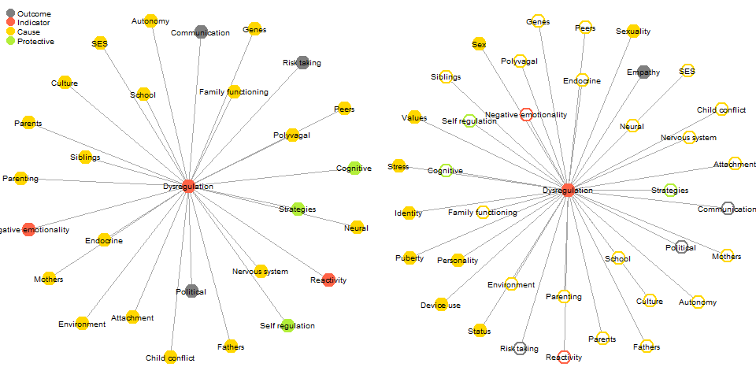
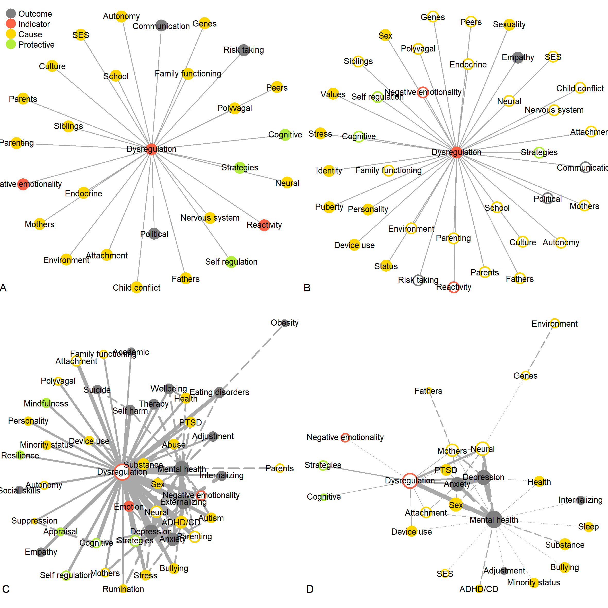
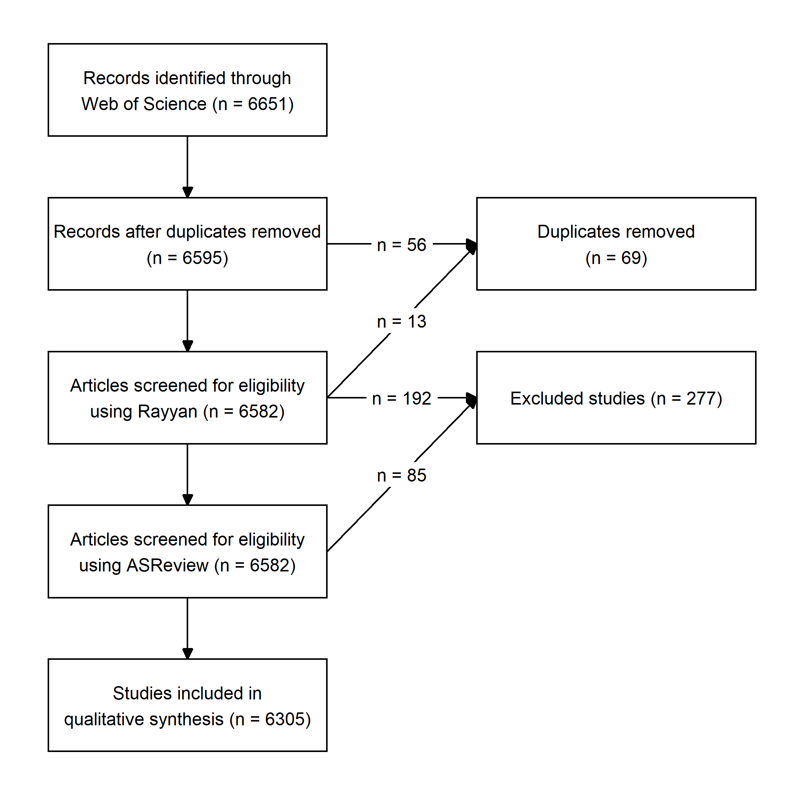
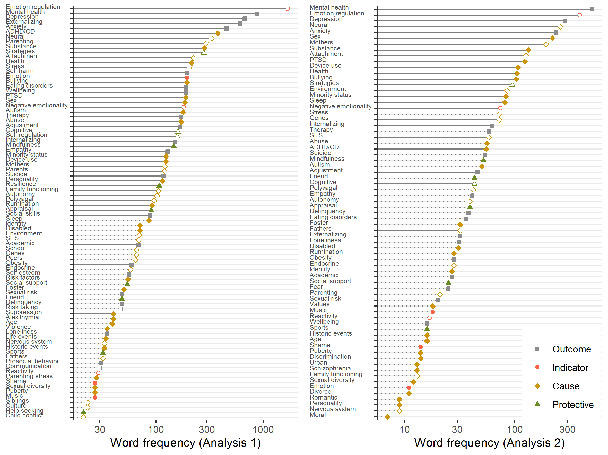
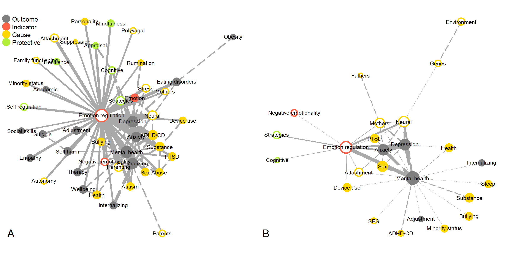
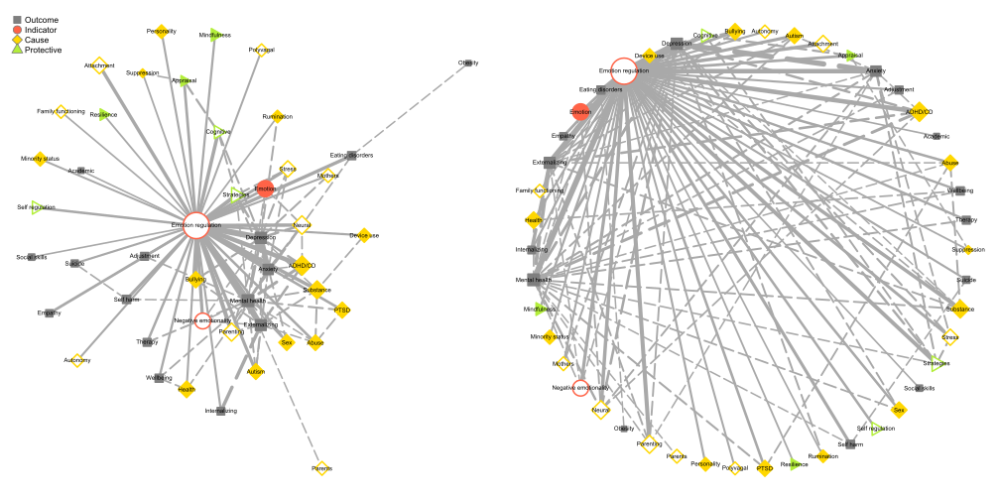
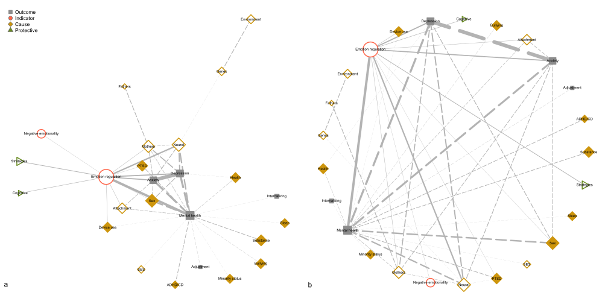

```{r setup, include = FALSE}
library("papaja")
library(data.table, quietly = TRUE, warn.conflicts = FALSE)
library(knitr)
library(kableExtra)
library(cowplot)
run_everything <- FALSE
notingraph <- list()
keyw <- function(x){
  x
}
```
<!-- Reviewer suggestions:
Kristin Buss -->

```{r analysis-preferences}
# Seed for random number generation
set.seed(42)
knitr::opts_chunk$set(cache.extra = knitr::rand_seed, echo = FALSE, message = FALSE, warning = FALSE, results="hide")
```

Adolescence is a life stage ranging from pubertal onset to adult-like independence [@steinbergAgeOpportunityLessons2014; @sawyerAgeAdolescence2018].
A key developmental challenge in this stage is acquiring mature emotion
regulation skills [@croneUnderstandingAdolescencePeriod2012;
@zimmermannEmotionRegulationEarly2014]. 
Adolescents experience biological, cognitive, and social changes that prompt new emotional
experiences and tax regulatory abilities [@steinbergAgeOpportunityLessons2014].
These coalescing changes temporarily restrict adolescents' capacity for emotion regulation 
[@zimmermannEmotionRegulationEarly2014],
resulting in more frequent and intense (negative) emotions [see @silkAdolescentsEmotionRegulation2003].

Although most adolescents eventually develop mature emotion regulation abilities,
for as many as one in five [@leeAdolescentMentalHealth2014],
adolescence marks the onset of
life course persistent emotion regulation-related psychopathology
[see also @aldaoEmotionregulationStrategiesPsychopathology2010;
@schaferEmotionRegulationStrategies2017].
Given the prevalence of emotion regulation difficulties in adolescence,
their implications for mental health<!--and social functioning [@braetEmotionRegulationChildren2014]; @reindlSocializationEmotionRegulation2016]-->
and downstream cost to society,
it is important to have a comprehensive overview of the factors associated with adolescents' emotion regulation.
Of particular interest are potential risk factors that render some youth susceptible to emotion regulation difficulties.
Despite the abundance of publications in this field,
several prior theoretical and empirical reviews have argued that the literature is somewhat fragmented,
because different (sub)disciplines have approached the issue in disparate ways,
in the absence of consistent terminology and unifying theory 
[@bussTheoriesEmotionalDevelopment2019; @bariolaChildAdolescentEmotion2011; @stifterEmotionRegulation2019].

This has led to recent calls for the consolidation of empirical insights into overarching theory [e.g., @bussTheoriesEmotionalDevelopment2019]. 
Formal methods for theory construction state that the first step in this endeavor is to identify the relevant *empirical phenomena* [@borsboomTheoryConstructionMethodology2020; @haigExploratoryFactorAnalysis2005],
defined as stable and general features of the world [@bogenSavingPhenomena1988].
We propose that systematic reviews are a suitable method for taking this first step,
based on the assumption that phenomena considered to be stable and general will be more frequently represented in the published literature.<!-- the frequency with which phenomena occur in the literature is indicative of their relevance.-->
Traditional narrative reviews have some limitations, however, as they been shown to be marred by small convenience samples, confirmation bias,
and an undue emphasis on positive results [@littellEvidencebasedBiasedQuality2008].
We intend to overcome these limitations by adopting a novel method:
the text mining systematic review (TMSR).
Relative to narrative reviews, text mining can cover arbitrarily greater corpora,
and gleans insights from the literature by means of a more transparent and reproducible process.
<!--Where sentient readers tend to structure their reading of the literature around established ideas [@littellEvidencebasedBiasedQuality2008],
the inherent "fairness" of text mining gives emerging themes a chance to come to the fore.-->

The present paper uses this novel approach to map the empirical phenomena relevant to adolescent emotion regulation.
This approach considers the frequency with which phenomena occur in the literature to be indicative of their relevance.
If we additionally assume that the frequency with which phenomena are studied together is indicative of the extent to which researchers believe them to be associated,
then the co-occurrence of phenomena within publications can be interpreted as a rudimentary nomological network: a mapping of relationships between theoretically relevant phenomena [see @alaviAligningTheoryMethodology2018].
This network can serve as a starting point for the formulation of a proto-theory,
which would additionally involve abductive reasoning: specifying putative mechanisms to explain associations between the phenomena [@borsboomTheoryConstructionMethodology2020].
By mapping the phenomena relevant to adolescent emotion regulation,
the present work thus lays the groundwork for future theory development.

<!--
Where sentient readers tend to structure their reading of the literature around established ideas [@littellEvidencebasedBiasedQuality2008],
This potentially reveals phenomena and associations missed by narrative reviewers,
thereby laying the groundwork for future empirical and theoretical work.


we set out to map these relevant empirical phenomena using a systematic review.


generate a proto-theoretical nomological network of the relevant empirical phenomena.
We discuss how this nomological network relates to existing relevant theory, and conclude
with recommendations for future theory-generating efforts.
There have been calls for the  consolidation of these disparate insights into overarching theory would be an important step forward.
An important first step 
and intrinsic limitations of narrative reviews prohibit comprehensive coverage of the vast but diffuse literature .-->
<!--
Recent years have seen the publication of several excellent systematic reviews,
but these have all been narrative reviews.-->

 <!-- CJ To fill out gaps, following up on promising constructs and unify heretofore disparate regions of the lit -->
<!-- SH: this implies that the main contribution of the paper is predominantly methodological is that the case? Is there some primary thesis/argument that will be advanced? It is really important to take a top-down approach to that messaging, beginning here in the first paragraph-->
<!-- Ergens anders: Similarly, although
there are several *relevant* theories, there is no specific theoretical
framework to guide research on adolescents' emotion regulation. Although theory
development is beyond the scope of this paper, we set out to generate a
proto-theoretical nomological network of the potential risk factors,
manifestations, and outcomes of emotion regulation in adolescence. We discuss
how this nomological network relates to existing relevant theory, and conclude
with recommendations for future theory-generating efforts.-->
<!-- At the same time, the staggered development of motivational-emotional and regulatory brain circuits gives rise
to a maturity gap [@croneUnderstandingAdolescencePeriod2012]. 
This leads youngsters to pursue new experiences in life and love,
without being fully prepared to cope with the emotional outcomes. --> 

<!--The literature thus paints a picture of
adolescence as a chrysalis for emotional development: Children enter this stage
with emotion regulation skills adapted to the challenges of childhood. During
adolescence, emotional systems are rearranged substantially.-->

<!--
* intense negative emotions in daily life (Silk, Steinberg, & Morris, 2003) 
* unstable peer or romantic relationships (Furman & Collins, 2009)
* decrease in perceived support from parents (Furman & Buhrmester, 1992).
* early adolescence is characterized by a higher rate of conflicts with parents (Laursen, Coy, & Collins, 1998)
* higher variability of negative emotions compared to late adolescence (Larson, Moneta, Richards, & Wilson, 2002).
* relative to other developmental stages, adolescence involves a particularly large number of transitions, novel situations, and new stimuli, physical, cognitive, emotional, and social development—particularly in early and mid-adolescence (Seiffge-Krenke, 2000)
-->

## Existing theoretical landscape

```{r baselinecode, message=FALSE, echo = FALSE, warning = FALSE, error=FALSE, results='hide'}
library(data.table)
library(stringr)
library(udpipe)
library(igraph)
library(wordcloud)
library(Matrix)
library(ggplot2)
library(yaml)
source("word_functions.R")
source("circle2.R")
dict <- read_yaml("yaml_dict.txt")

  
  bl_theory <- readLines("baseline_theory.txt")
  bl_review <- readLines("baseline_reviews.txt")
  df <- data.frame(word = trimws(tolower(bl_theory)), source = "theory")
  df <- rbind(df, data.frame(word = trimws(tolower(bl_review)), source = "reviews"))
  # Categorize words
  res_cat <- cat_words(df$word, dict, handle_dups = "all")
  df$cat <- res_cat$words
  df <- df[!duplicated(df$cat), ]
  if(!is.null(res_cat[["unmatched"]])){
    df <- df[!df$cat %in% names(res_cat$unmatched), ]
  }
  
  baseline_cat <- df
  baseline <- c("dysregulation", unique(df$cat[df$source == "theory"]))
  
  saveRDS(baseline, "baseline.RData")
  saveRDS(baseline_cat, "baseline_cat.RData")

in_theory <- df$word[df$source == "theory"]
in_rev <- df$word[!df$source == "theory"]
in_rev[!in_rev %in% in_theory]

df_plot <- data.frame(term1 = df$cat[df$source == "theory"], term2 = "dysregulation")
df_plot <- df_plot[!df_plot$term1 == df_plot$term2, ]
edg <- df_plot

edg$width = 1

vert <- data.frame(name = unique(c(df_plot$term1, df_plot$term2)), label = pretty_words(unique(c(df_plot$term1, df_plot$term2))), size = 1)
vert <- vert[vert$name %in% unique(c(edg$term1, edg$term2)), ]

categ <- read.csv("study1_categorization.csv", stringsAsFactors = FALSE)
if(any(!vert$name %in% categ$name)){
  write.table(vert$name[!vert$name %in% categ$name], "clipboard", sep = "\n", row.names = FALSE, col.names= FALSE)
  stop("Please re-categorize missing vertices.")
} 
vert$Category <- categ$category[match(vert$name, categ$name)]

cat_cols <- c(Outcome = "gray50", Indicator = "tomato", Cause = "gold", Protective = "forestgreen")
cat_cols <- c(Outcome = "gray50", Indicator = "tomato", Cause = "gold", Protective = "olivedrab2")
vert$color <- cat_cols[vert$Category]
vert$frame.color <- cat_cols[vert$Category]

vert$size <- scales::rescale(log(vert$size), c(4, 12))
g1 <- graph_from_data_frame(edg, vertices = vert,
                           directed = FALSE)


# Plot 2 ------------------------------------------------------------------

df_plot <- data.frame(term1 = df$cat, term2 = "dysregulation", source = df$source)

edg <- df_plot

edg$width = 1

vert <- data.frame(name = unique(c(df_plot$term1, df_plot$term2)), label = pretty_words(unique(c(df_plot$term1, df_plot$term2))), size = 1)
vert <- vert[vert$name %in% unique(c(edg$term1, edg$term2)), ]

categ <- read.csv("study1_categorization.csv", stringsAsFactors = FALSE)
if(any(!vert$name %in% categ$name)){
  write.table(vert$name[!vert$name %in% categ$name], "clipboard", sep = "\n", row.names = FALSE, col.names= FALSE)
  stop("Please re-categorize missing vertices.")
} 
vert$Category <- categ$category[match(vert$name, categ$name)]
vert$faded <- vert$name %in% df$cat[df$source == "theory"]
cat_cols <- c(Outcome = "gray50", Indicator = "tomato", Cause = "gold", Protective = "olivedrab2")
vert$color <- cat_cols[vert$Category]
vert$frame.color <- cat_cols[vert$Category]

vert$color[vert$faded] <- "#FFFFFF"

vert$size <- scales::rescale(log(vert$size), c(4, 12))
g2 <- graph_from_data_frame(edg, vertices = vert,
                           directed = FALSE)


set.seed(4) #4 #2 #3
l1 <- l <- layout_with_fr(g1)
set.seed(3)
l2 <- layout_with_fr(g2)

p <- quote({
  # Set margins to 0
  par(mar=c(0.5,0.5,0.5,0.5),
      mfrow=c(1,2))
  plot(g1, edge.curved = 0, layout=l1,
       vertex.label.family = "sans",
       vertex.label.cex = 0.7,
       vertex.shape = "circle2",
       #vertex.frame.color = 'gray40',
       vertex.label.color = 'black',      # Color of node names
       vertex.label.font = 1,         # Font of node names
       vertex.frame.width = 2
  )
  text(-1.1, y = -1, labels = "A")
  legend(x=-1.2, y=1.1, names(cat_cols), pch=21, col=cat_cols, pt.bg=cat_cols, pt.cex=1.6, cex=.7, bty="n", ncol=1)
  plot(g2, edge.curved = 0, layout=l2,
       vertex.label.family = "sans",
       vertex.label.cex = 0.7,
       vertex.shape = "circle2",
       #vertex.frame.color = 'gray40',
       vertex.label.color = 'black',      # Color of node names
       vertex.label.font = 1,         # Font of node names
       vertex.frame.width = 2
  )
  text(-1.1, y = -1, labels = "B")
})
saveRDS(g1, "bl_g1.RData")
saveRDS(g2, "bl_g2.RData")
saveRDS(l1, "bl_l1.RData")
saveRDS(l2, "bl_l2.RData")
# Save files

png("baseline_network.png", height = 100, width = 200, units = "mm", res= 300)
eval(p)
dev.off()

svg("baseline_network.svg", width = 14)
eval(p)
dev.off()
```

```{r figbaseline, warning=FALSE, eval = TRUE, results='asis', out.width = "100%", fig.cap="Phenomena relevant to adolescents' emotion regulation according to theory (A) and narrative reviews (B; transparent circles indicate constructs also present in the theory)."}
 
```
```{r allnetworks, warning=FALSE, eval = FALSE, results='asis', out.width = "100%", fig.cap="Correlates of emotion regulation difficulties according to theory (A), narrative reviews (B), and term co-occurrence in author keywords (C) and abstracts (D). Size of lines and circles represents frequency. Dashed lines represent links not involving dysregulation. Transparent circles indicate constructs also represented in the theory (panel A)."}

 
```

Although it has been argued that there is a paucity of theories *specific to* adolescent emotion regulation,
many *relevant* theories are commonly invoked in empirical work [see  @bussTheoriesEmotionalDevelopment2019].
In order to contextualize the results of our systematic review
and assess to what extent the identified phenomena through text mining mirror or complement existing theory,
we provide a brief review of the existing theoretical landscape.
Others have published more detailed reviews of theories of emotional development [@bussTheoriesEmotionalDevelopment2019] and emotion regulation in adolescence [@riedigerEmotionRegulationAdolescence2014].
In reading the theoretical literature,
we documented relevant phenomena and whether these were discussed as putative causes, outcomes, indicators, or protective factors in relation to emotion regulation.
The left panel of Figure \@ref(fig:figbaseline) visually summarizes the phenomena discussed in the theoretical literature, using a style similar to our subsequent systematic review,
in order to facilitate contextualizing our original findings.
<!-- 
Our text mining analysis of the phenomena empirical literature is best understood against a backdrop of -->

Two of the most general theories invoked to frame developmental research are Bronfenbrenner's bioecological model, and Sameroff's
transactional model.
Bronfenbrenner [-@bronfenbrennerBioecologicalModelHuman2007] describes how the `r keyw("environment")`
shapes individual development.
At the individual level, every person is imbued with `r keyw("biological")` predispositions,
and develops over time in interaction with contextual influences.
The most immediate source of contextual influences is the microsystem,
composed of people close to the individual.
Other influences stem from the macrosystem, consisting of `r keyw("political")` and `r keyw("economic")` influences,
and the exosystem, consisting of `r keyw("cultural")` norms and `r keyw("values")`.
Sameroff's model [-@sameroffUnifiedTheoryDevelopment2010] is compatible with Bronfenbrenner's work,
but places a stronger emphasis on development as a product of reciprocal influences between child and environment.
Sameroff distinguishes between proximal influences, which roughly correspond to the microsystem in Bronfenbrenner's model, and distal influences, which derive from
structural factors indirectly shaping development, like `r keyw("socio-economic status")`,
`r keyw("schools")`, and the `r keyw("community")` (macro- and exosystem).
With increasing age, distal influences gain ground on proximal influences.
These two theories have a broader scope than most.
This means that they can be invoked to contextualize any developmental study,
but lack specificity - a shortcoming that curtails a theory's utility in generating hypotheses.
We thus turn toward more domain-specific theories.

Among the oldest domain-specific theories of adolescents' emotional development is Hall's notion of "storm and stress" [see
@arnettAdolescentStormStress1999].
It describes how `r keyw("hormonal")` changes diminish `r keyw("self-control")` and increase `r keyw("reactivity")`, which in turn leads to emotion
regulation difficulties, increased `r keyw("conflict with parents")`, and `r keyw("risky behavior")`.
Hall's notion of diminished self-control and increased emotional reactivity still persists in modern theory, but is increasingly recast as a normative change that facilitates emotional maturation at the risk of emotional
disturbance [@arnettAdolescentStormStress1999; @leeAdolescentMentalHealth2014].
[@croneUnderstandingAdolescencePeriod2012] 
A potential limitation of Hall's notion of storm and stress is that it describes emotion regulation difficulties as a part of normative development, and thus underemphasizes adolescents' diverging destinies [cf. @croneUnderstandingAdolescencePeriod2012].
<!--SH I am still not sure what the empirical contribution is - can you be more specific with it in this sentence? -->
<!--Several recent publications have undertaken the
monumental task of providing a comprehensive overview of theories of emotional
development [e.g., @bussTheoriesEmotionalDevelopment2019;
@holodynskiDevelopmentEmotionsEmotion2006;
@riedigerEmotionRegulationAdolescence2014], and of the empirical work
pertaining to emotions in adolescence
[@coe-odessEmergentEmotionsAdolescence2019].  -->

Sroufe's [-@sroufeEmotionalDevelopmentOrganization1995] theory of normative emotional development focuses on developmental influences to a greater extent.
Sroufe argues that, as children grow older,
their increasing `r keyw("self-regulatory")` abilities
drive a transition from external emotion regulation by `r keyw("primary caregivers")`
towards autonomous emotion regulation.
This theory focuses on two drivers of
development: `r keyw("social")` and `r keyw("cognitive influences")`. 
Social influences mainly occur
through `r keyw("parental co-regulation")`, `r keyw("parenting behaviors")`, and parent-child
`r keyw("attachment")`. Cognitive influences occur through the development of the `r keyw("central
nervous system")` (CNS), `r keyw("cognition")`, and `r keyw("self-regulation")`.
This theory's relevance for adolescent research may be diminished by its focus on early childhood,
although there is substantial continuity in developmental influences throughout childhood and adolescence.
For instance, there is substantial similarity between mothers' and fathers' unique roles in emotional development in childhood [@vanlissaMothersFathersQuantitative2020] and adolescence [@vanlissaRoleFathersMothers2019].
In terms of level of analysis, the scope of Sroufe's and Hall's theories corresponds approximately to the individual and the microsystem in Bronfenbrenner's ecological model.
The emphasis on socialization and `r keyw("neurocognitive development")` as two drivers of emotional development, which is evident from both theories,
is the focus of several theories with a narrower scope.

Among theories focused on socialization, Morris' tripartite model is widely cited in the field [-@morrisRoleFamilyContext2007].
This theory describes three pathways through which `r keyw("parents")` shape emotion regulation
development: `r keyw("modeling")`, `r keyw("parenting practices")`, and the
emotional `r keyw("family climate")`,
which subsumes attachment and `r keyw("marital relationship")` quality.
This theory focuses parents, acknowledging unique contributions by `r keyw("mothers")` and `r keyw("fathers")`, but also recognizes the importance of siblings.
Others in turn have adapted the tripartite model to describe the influence of peers [@reindlSocializationEmotionRegulation2016], thus illustrating its wider usefulness in understanding socialization.
A more abstract take on socialization is found in @holodynskiDevelopmentEmotionsEmotion2006's
internalization model of emotional development. 
This theory describes the role of emotion in `r keyw("communication")`, and the `r keyw("cultural")` symbolic function of emotion.

In research on neurocognitive aspects of adolescents' emotion regulation,
`r keyw("polyvagal theory")` has been influential [@porgesOrientingDefensiveWorld1995].
This theory examines `r keyw("emotional experience")` and -regulation in relation to autonomous nervous system functioning, respiratory sinus arrhythmia, and the stress response.
Although polyvagal theory is relevant for development,
it does not explicitly address it.
Among neurocognitive developmental theories,
there is some consensus that the developmental asymmetry between `r keyw("motivational")`-emotional and inhibitory `r keyw("brain")` circuits gives rise to a "maturity gap" in middle adolescence [@croneUnderstandingAdolescencePeriod2012; @caseyBrakingAcceleratingAdolescent2011; @craccoEmotionRegulationChildhood2017].
Particularly noteworthy is Crone and Dahl's  model of social-affective engagement and `r keyw("goal flexibility")`.
According to this model, adolescents' cognitive engagement is dynamically responsive to
social and motivational `r keyw("goal salience")`.
This flexibility <!--, on the one hand,-->
prepares adolescents to <!--effectively engage cognitive systems in novel
challenging situations in a way that facilitates--> develop mature regulatory
abilities, but also places them at risk of impulsivity in
pursuit of `r keyw("peer approval")`.
To a greater extent than related writings, Crone and Dahl's model focuses on adolescents diverging destinies;
why some youngsters flourish while others languish.
This is important for understanding individual differences in development.
The relevance of this theory is enhanced by its focus on adolescence,
but is curtailed because it only tangentially addresses emotion regulation.
Furthermore, whereas this theory addresses the role of cognitive factors and peers as drivers of development, it devotes less attention to other relevant phenomena, such as parenting [cf. @morrisRoleFamilyContext2007].
Micro-scale theories as reviewed here are useful in explaining specific phenomena in detail,
but do not provide a comprehensive understanding of adolescent's emotion regulation.
To this end, it is important to consider these micro-scale theories in the context of a larger framework of relevant phenomena.

<!--Like Sroufe, Holodynski describes an age graded transition from
interpersonal to intrapersonal emotion regulation.
In doing so, Holodynski applies Vygotsky's theory of development to the domain of
emotion, and presents a detailed integrated model of emotional experience and
regulation.-->
Theories of the phenomenon of emotion regulation offer insight into
intra-individual drivers of emotion regulation development.
Gross' [-@grossHandbookEmotionRegulation2013] influential process model describes the
phenomenon of emotion regulation, from eliciting cue to ultimate response.
According to Gross, individuals use `r keyw("strategies")` to modulate the different stages of this process,
consciously or otherwise. 
Individuals who engage in maladaptive emotion regulation strategies tend to experience more negative emotions,
diminished well-being, and greater strain in interpersonal relationships
[@grossIndividualDifferencesTwo2003a; @bellRelationshipsInputsOutputs2000].
However, comparative studies indicate that the adaptive versus maladaptive psychosocial consequences of specific strategies appear to be partly contingent on the `r keyw("cultural context")` [see
@bariolaChildAdolescentEmotion2011].
Similar to Gross' theory, the "social
information processing" theory also describes the role of cognitive
processes and strategies in emotion regulation
[@lemeriseIntegratedModelEmotion2000].
One shortcoming of these theories for understanding adolescents' emotion regulation 
is the lack of a developmental component.

<!-- RK: What do you take from these broad perspectives for your RQ?-->
<!--SH I am not sure what contribution this paragraph ultimately makes - you should consider condensing it substantially to just note that these theories have something to say about emotional development but are not adolescent-specific-->
<!--Theories like this are particularly relevant to a fine-grained
understanding of the process of emotion regulation, but their developmental
relevance has unfortunately not yet been considered (REF Buss). -->
<!--Parents are widely considered to be the primary proximal influence driving
emotion regulation development.
Yet several limitations remain.
@coe-odessEmergentEmotionsAdolescence2019;
instead takes an inductive approach to map the correlates of adolescents'
emotion regulation based on all available literature.

The present study instead takes an inductive approach to map the correlates of
adolescents' emotion regulation based on all available literature. From this
mapping, we proceed to classify correlates as potential risk factors,
manifestations, and outcomes of adolescent emotion regulation. The results
provide a conceptual overview of the existing literature, can help identify
blind spots in existing theory, and might inspire new hypotheses to guide
future deductive research.

Several limitations emerge from prior efforts to provide an encompassing
framework of this literature

These efforts at unification have, thusfar, been conducted in a top-down,
theory-driven manner.

which motivates most youngsters to seek out challenges in life and love, but
renders some of them vulnerable to emotion dysregulation.  -->

<!--
Note that the left panel of Figure \@ref(fig:tmnetworks) visually summarizes the correlates of emotion regulation difficulties (labeled: *Dysregulation*) according to our theoretical review.
The left panel of Figure \@ref(fig:tmnetworks) summarizes key constructs covered by the theories reviewed above. 
In the subsequent text mining analysis, we will distinguish the topics covered in this theoretical review visually to highlight unique contributions of our approach.
This allows us to see in what respects the text mining analysis reflects existing theory,
and in what respects it complements it.-->

### Shortcomings of existing theory

Despite the abundance of theory *relevant* to emotion regulation in adolescence,
the literature has several limitations.
First, few theories have explicitly addressed adolescence.
This life stage differs qualitatively from both childhood and adulthood [@bariolaChildAdolescentEmotion2011].
It is therefore questionable whether theories focused on different age groups can be generalized to adolescents.
<!--Relatedly, many relevant theories lack an explicit developmental component, which renders them and thus lack a well-substantiated
understanding of developmental processes[see
@bussTheoriesEmotionalDevelopment2019;
@croneUnderstandingAdolescencePeriod2012]. -->
Furthermore, few theories have comprehensively addressed important predictors of development in this life stage,
and none directly guide contemporary research in the field [see @bussTheoriesEmotionalDevelopment2019; @riedigerEmotionRegulationAdolescence2014].
Finally, existing theories vary widely in scope:
Some are broad and non-specific; others describe a specific phenomenon in detail,
but lack a broader perspective.
Broad theories can be used to frame a wide variety of research,
and specific theories are more suitable for deductive hypothesis generation.
To combine the strength of both, it would be beneficial to bridge these levels of analysis.
In sum, there is a need for more integrative theory formation,
in order to provide a unified framework that could guide future empirical work.<!--[see @riedigerEmotionRegulationAdolescence2014].
Inductive analysis of the empirical literature may constitute a first step to this end.-->
<!--Such a theory should focus on -->
The present study lays the groundwork for such theory development,
by identifying theoretically relevant phenomena based on a text-mining systematic review of the literature.

<!--
Barriola: What is most
* evident from the reviewed studies is that the samples
investigated have been mainly non-clinical, within the
early childhood period of development and have examined
predominantly maternal socialization factors.
* the vast
majority have been restricted to toddlers and young chil-
dren and have only examined the in?uence of maternal,
and not paternal, expression.
Most of the literature has addressed emotion regulation in adult or infant
samples. A smaller, but substantial, portion of the literature has examined
emotion regulation in adolescents.
-->

<!-- Next paper: * Existing theory is not very specific, in the sense that it
can give rise to concrete, testable predictions. "either is not guided by
hypotheses of an explicit theory or cites a theory but does not explicitly test
the theory." (Buss) (Smaldino)-->
<!--Unfortunately, there is little theory about which risk factors and
environmental hazards render adolescents susceptible to emotional
difficulties11-->

<!--Initially, much of the research on emotion regulation focused on either
adulthood or early childhood. In recent years, however, a substantial body of
research on emotion regulation in adolescence has accrued.-->

<!--What are the predictors of emotion regulation in adolescence?-->

<!--Emotion regulation can be defined as the ability to modulate emotional
experience and expression through automatic or deliberate processes. -->


<!--


## Why focus on theory?


A focus on theory is becoming increasingly important, given the concern about
the replicability of social scientific findings [@KLEIN].

Several authors of comprehensive reviews have noted that developmental theories
of emotion are still in their infancy [@bussTheoriesEmotionalDevelopment2019].
Several specific limitations of the theoretical landscapes precipitate the
present study. First, although there are many *relevant* theories, few are
focused specifically on emotion regulation. Second, the stage of adolescence is
rarely addressed, although empirical research has indicated that this is a
crucial period of emotion regulation development.
"emotion theory has largely focused on adults, and emotional development theory
has largely focused on infancy and early childhood (see Chap. 24 on adolescent
emotional development)." Buss et al 2019:20

## Why inductive -->

## Prior narrative reviews

Whereas theory provides a top-down deductive understanding of adolescents' emotion regulation,
literature reviews synthesize inductive insights emerging from the empirical literature.
Given the noted absence of a single overarching theory [see @bussTheoriesEmotionalDevelopment2019],
reviews are especially important,
as they provide additional
insight into undertheorized relevant phenomena.
Two recent narrative reviews in particular complement the aforementioned theoretical literature [@coe-odessEmergentEmotionsAdolescence2019; @bariolaChildAdolescentEmotion2011].
The right panel of Figure \@ref(fig:figbaseline) visualizes constructs uniquely covered by these narrative reviews,
relative to the preceding theoretical literature.
This illustrates in what respects these reviews reflect existing theory,
and in what respects they complement it.
<!--
Note that the left panel of Figure \@ref(fig:tmnetworks) visually summarizes the correlates of emotion regulation difficulties (labeled: *Dysregulation*) according to our theoretical review.
The left panel of Figure \@ref(fig:tmnetworks) summarizes key constructs covered by the theories reviewed above. 
In the subsequent text mining analysis, we will distinguish the topics covered in this theoretical review visually to highlight unique contributions of our approach.
This allows us to see in what respects the text mining analysis reflects existing theory,
and in what respects it complements it.-->

The seminal review by @bariolaChildAdolescentEmotion2011 was one of the first to stress the urgent lack of an overarching theoretical framework to guide research in this field.
Their review addressed relevant phenomena at different levels of analysis. 
At the individual level, relevant phenomena include temperament and biological factors, like neurocognitive development and genes.
At the level of proximal influences, the authors discuss socialization and modeling by parents, teachers, and peers.
Finally, at the level of distal influences, culture and the media are discussed.
Barriola and colleagues made several important observations about the state of the literature in this field.
For instance, they emphasized that work on children cannot be straightforwardly extrapolated to the life stage of adolescence.
They also called for further research on parents' role beyond early childhood, and on fathers' role in emotion socialization -
a topic that of increasing importance [see @pleckPaternalInvolvementRevised2004].
Several recent publications have conducted research in line with these recommendations [e.g., see @vanlissaRoleFathersMothers2019;
@vanlissaMothersFathersQuantitative2020].

As the review by Barriola and colleagues is now a decade old,
it is worth considering the more recent review by @coe-odessEmergentEmotionsAdolescence2019. 
This review complements prior work by offering a nuanced discussion of several topics.
At the individual level, this includes the implications of physiological changes,
including neurocognitive development and pubertal maturation.
Pubertal development also precipitates sexual and romantic behavior,
and the intensification of both biological sex differences and gender stereotyped behavior.
This, in turn, likely modulates proximal influences through peers.
<!--With regard to the process of emotion regulation,
Coe-Odess and colleagues discuss the importance
of strategies, and point out that, in addition to negative emotionality,
positive emotionality also peaks in adolescence. -->
The authors further describe how individual hormonal changes intensify the stress response,
which relates to adolescents' greater susceptibility to emotion regulation difficulties.
Finally, going beyond the implications of cognitive development
discussed in other publications, the authors discuss how cognitive development and increased capacity
for abstract thought relate to identity formation - a key challenge in
adolescence [@meeusStudyAdolescentIdentity2011] - and to increased emotional
understanding, and by extension, empathy [see also
@vanlissaLongitudinalInterplayAffective2014].
At the level of proximal influences, Coe-Odess and colleagues expand on the role of conflict with parents, which peaks in adolescence as youth become increasingly individuated.
This is relevant because parent-adolescent conflict has been shown to impact both day-to-day mood swings and dispositional emotion regulation [see @vanlissaCostEmpathyParentadolescent2017].
Coe-Odess and colleagues further detail the mechanisms by which peers exert proximal influences: Adolescents become increasingly oriented towards peers, which
increases their sensitivity to social status and norms,
along with concomitant increases in peer pressure and risk taking.
This review devotes limited attention to distal influences.

There are notable parallels between phenomena relevant to adolescents' emotion regulation as identified in these
narrative reviews, and in the preceding theoretical literature, as can be seen in Figure \@ref(fig:figbaseline).
Nevertheless,
these literature reviews also touch upon issues that have received little
attention in theoretical work.
<!--These include specific individual differences at the biological and psychological level, including genetic predisposition, hormones, pubertal onset, gender, sexuality, temperament, identity, empathy, and stress.
Further introduced are proximal influences, including the role of media, norms, and social status.-->
This illustrates the general principle that reviews of the empirical literature can contribute inductive insight into relevant phenomena underrepresented in theory.
An important shortcoming is that all reviews in this field have been unstructured narrative reviews, which are known to be limited in scope and biased [@littellEvidencebasedBiasedQuality2008].
We seek to complement preceding work by using text mining to conduct a more comprehensive and objective empirical
literature review, and map the phenomena relevant to adolescent emotion regulation.

<!--Where sentient readers tend to structure their reading of the literature around established ideas,
text mining has the potential to reveal phenomena and associations missed by narrative reviewers,
thereby laying the groundwork for future empirical and theoretical work.-->


<!-- NIET TEVEEL OVER THEORIE PRATEN; IK KIJK NIET NAAR THEORIE. IK KIJK NAAR FACTOREN DIE IN VERBAND GEBRACHT WORDEN MET EMOTIEREGULATIE. -->
<!--The life stage of adolescence differs qualitatively from both childhood and adulthood. It is therefore not sufficient to extend -->

<!--
Influences on emotion regulation (Riediger Klipker)
* Neurophysiological development 
* Familial context


Despite widespread interest in emotion regulation in adolescence, there is a lack of explicit theories about which risk factors and environmental hazards render adolescents susceptible to emotional difficulties. Some theories can be considered relevant, but these theories are rarely explicit enough to generate specific predictions. 
As many as one in five adolescents experiences severe emotional problems. A key question is therefore which factors render adolescents at-risk for difficulties in emotion regulation. 

Unfortunately, relevant theory on adolescent emotion regulation development is limited27–29. The field is therefore at an impasse: We know that some adolescents are more susceptible to emotion dysregulation than others, but lack tools and theory to identify important predictors of individual development30.

inductive approach, thereby facilitating a more complete understanding of developmental processes, and nourishing theory formation

My work addresses this lacuna by taking an inductive approach to theory formation; paying special attention to between-person differences. This paves the way for a new wave of person-centered research


Key questions:

Why focus on emotion regulation specifically, instead of other aspects of emotional development?

* Biological determinants
* Social determinants

* Existing developmental theories do not focus on adolescence (rather, on adults, or development in infancy and childhood). However, many interesting emotion-related things happen in adolescence.

Important:
Buss: theories of emotion and emotional development
Cracco: Evidence for a maladaptive shift in emotion regulation in adolescence
Zimmermann & Iwanski: Dip in adolescence

Sroufe 1995: Development of emotion regulation until preschool age
"the key progression in emotional regulation is from caregiver-orchestrated
regulation to dyadic regulation to self-regulation."
* attachment - dyadic regulation of emotion (Sroufe 1996)
* Caregiver-guided self-regulation 
* Autonomous self-regulation
***** HOWEVER: In adolescence, regulatory brain regions still developing!!!! So Sroufe stops too early

Polyvagal theory Porges 1995 -->

<!-- SH: ultimately I think that the introduction is too long - considering that the introduction, itself, is a literature review to some extent, I don't come away with a clear delineation between the literature review up this point and the new work you are going to contribute. I think you need to review the Introduction with an eye on focusing the discussion on the problems/gaps that exist and how the lit review method usually used are insufficient for addressing those issues-->

## The present paper

The present paper set out to map the phenomena relevant to adolescent emotion regulation
using a text mining systematic review (TMSR) of the literature.
This approach considers the frequency with which a phenomenon is covered in the literature to be indicative of its relevance,
and the frequency with which phenomena are investigated together within publications to be indicative of a relationship between these constructs.
The expected outcomes consist of term frequency metrics,
which can be rank ordered to identify the most relevant phenomena,
and term co-occurrence metrics.
These metrics can be jointly visualized as a network graph,
thereby "mapping" phenomena relevant to adolescent emotion regulation.
Note that this study is inductive (exploratory),
as opposed to deductive (confirmatory) research, and as such does not test any hypotheses [see De Groot's work on the empirical cycle @degrootMethodologieGrondslagenVan1961].
Inductive methods are suitable for the detection of phenomena,
as they aim to generalize from observations (data) without appeal to theory [@haigExploratoryFactorAnalysis2005].

<!--The distinction between inductive and deductive research has recently been recast as a "creativity-verification" cycle [@wagenmakersCreativityVerificationCyclePsychological2018].-->

# Methods

As the purpose of inductive research is to inform hypothesis generation,
this approach affords the researcher with substantial creativity [@wagenmakersCreativityVerificationCyclePsychological2018].
This means that subjective decisions are made throughout the analysis process.
To ensure that all such decisions are properly documented,
we have made all code, data, and the historical record of this project publicly available in an online research repository at [masked]. 
We used the Workflow for Open Reproducible Code in Science [WORCS, @vanlissaWORCSWorkflowOpen2020]
to make the analyses reproducible.
We encourage reuse of the analysis code,
and secondary analysis of the data.

## Search strategy

We searched Web of Science,
the most comprehensive database for which we had permissions to export keywords and abstracts.
The search strategy was based on
procedures described by Staaks [@staaksSystematicReviewSearch2019]. First, we
constructed a reference set of 29 articles.
Then we constructed a search string to retrieve this set.
The search string consisted of synonyms of emotion regulation and adolescence.
It returned 6653 results, including 25 records in the reference set.
To match all 29 reference set items required adding the terms `"emotio* socialization" OR "emotio* processes"` as synonyms for emotion regulation.
Doing so resulted in 191 more hits, most of which did not meet the inclusion criteria explained below.
We thus deemed these terms to be overly inclusive, and
proceeded with the original search string.
```{r readrecs}
filenam <- "recs_6653.RData"
if(!file.exists(filenam)){
  library(bibliometrix)
  f <- list.files("./recs/18-3-2020/", full.names = TRUE)
  f <- readFiles(f)
  recs <- convert2df(f)
  saveRDS(recs, filenam)
} else {
  recs <- readRDS(filenam)
}
```

```{r removeduplicates}
filenam <- "unique_recs.RData"
if(!file.exists(filenam)){
  library(revtools)
  recs$doi <- recs$DI
  recs$doi[is.na(recs$doi)] <- paste0("fake", 1:sum(is.na(recs$doi)))
  if(any(duplicated(recs$doi))){
    recs$doi[duplicated(recs$doi)|duplicated(recs$doi, fromLast = T)]
    dup_doi <- duplicated(recs$doi)
    recs <- recs[!dup_doi, ]
  }
  recs$title <- recs$TI
  # locate and extract unique references
  potential_dups <- find_duplicates(recs, match_variable = "title", match_function = "stringdist", threshold = 5, to_lower = TRUE, remove_punctuation = TRUE)
  unique_recs <- extract_unique_references(recs, matches = potential_dups)
  saveRDS(unique_recs, filenam)
  write.csv(data.frame(dup_doi = sum(dup_doi), dup_title = (nrow(recs)-nrow(unique_recs))-sum(dup_doi)), "dups.csv", row.names = FALSE)
} else {
  unique_recs <- readRDS(filenam)
  dups <- read.csv("dups.csv")
}
unique_recs$id_num <- 1:nrow(unique_recs)

if(FALSE){
  # df_screen <- unique_recs[, c("id_num", "TI", "AB")]
  # names(df_screen) <- c("id_num", "title", "abstract")
  # write.csv(df_screen, file = "asreview.csv", row.names = FALSE, fileEncoding = "UTF-8")
  df_screen <- unique_recs[, c("id_num", "TI", "AU", "SO", "SN", "VL", "IS", "BP", "PY", "PU", "DI", "AB")]
  names(df_screen) <- c("key", "title", "authors", "journal", "issn", "volume", "issue", "pages", "year", "publisher", "url", "abstract")
  write.csv(df_screen, file = "rayyan.csv", row.names = FALSE)
}
rayyan_res <- read.csv("rayyan_exports/articles.csv")
rayyan_dups <- nrow(unique_recs) - nrow(rayyan_res)

```

## Screening

```{r, message=FALSE}
screen <- read.csv("asreview_result_sysrevemotprob.csv")
screen <- screen[screen$key %in% rayyan_res$key, ]
screen$drop_these <- FALSE
screen$drop_these[which(screen$included == 1 | screen$rayyan == "False")] <- TRUE

if(!file.exists("recs_final.csv")){
  recs_final <- unique_recs[screen$key[!screen$drop_these], ]
  write.csv(recs_final, "recs_final.csv", row.names = FALSE)
} else {
  recs_final <- read.csv("recs_final.csv")
}
```

Starting with all `r nrow(recs)` records identified through Web of Science,
we removed duplicates based on DOI matches (n = 2) and title similarity (n = 54).
Rayyan QRCI [@Ouzzani2016] identified an additional 13 duplicates.
We then screened papers based on two main criteria:
They had to address emotion regulation or a synonymous construct, and the target population must overlap with the age range of adolescence (10-24) [as defined by @steinbergAgeOpportunityLessons2014; @sawyerAgeAdolescence2018].
Preliminary screening was conducted in Rayyan.
After coding `r sum(screen$rayyan == "True")+sum(screen$rayyan == "False")` papers (`r sum(screen$rayyan == "False")` excluded),
we continued screening in ASReview [@van_de_schoot_rens_2020_3828293].
This program uses machine learning to screen articles.
We trained the naive Bayes algorithm by manually screening an additional `r sum(table(screen$included, screen$rayyan)[, 1])` papers (`r sum(screen$included == 1, na.rm = TRUE)-sum(screen$rayyan == "False")` excluded), until among the most recently screened 100 papers only 6 were excluded.
In total, `r nrow(recs_final)` papers were deemed suitable for analysis.

```{r prismachart, eval = FALSE, results='asis', fig.cap="Record screening flowchart"}
if(run_everything){
  library(tidySEM)
  
  lo <- matrix(c("start", "dedup", "rayyan", "asreview", "included",
                 "", "dedup2", "excluded", "", ""), nrow = 5, ncol = 2)
  
  nodes <- data.frame(
    name = c("start", "dedup", "dedup2", "rayyan", "asreview", "included", "excluded"), 
    label = c(
      paste0("Records identified through\nWeb of Science (n = ", nrow(recs), ")"), 
      paste0("After duplicates removed\n(n = ", nrow(unique_recs), ")"), 
      paste0("Duplicates\n(n = ", nrow(recs)-nrow(screen), ")"), 
      paste0("Articles screened for eligibility\nusing Rayyan (n = ", nrow(screen), ")"), 
      paste0("Articles screened for eligibility\nusing ASReview (n = ", nrow(screen), ")"), 
      paste0("Studies included in\nqualitative synthesis (n = ", nrow(recs_final), ")"),
      paste0("Excluded studies (n = ", nrow(screen)-nrow(recs_final), ")"))
  )
  
  edges <- data.frame(
    from = c("start", "dedup", "rayyan", "asreview",
             "start", "rayyan", "rayyan", "asreview"),
    to = c("dedup", "rayyan", "asreview", "included",
           "dedup2", "dedup2", "excluded", "excluded"),
    label = c("",   "", paste0("n = ", sum(screen$rayyan == "True")), paste0("n = ", sum(screen$included == 0, na.rm = TRUE)-sum(screen$rayyan == "True")),
              paste0("n = ", sum(dups)), 
              paste0("n = ", rayyan_dups),
              paste0("n = ", sum(screen$rayyan == "False")),
              paste0("n = ", sum(screen$included == 1, na.rm = TRUE)-sum(screen$rayyan == "False"))
    )
  )
  
  p <- graph_sem(layout = lo, nodes = nodes, edges = edges, angle = 1, rect_height = 1.2, rect_width = 1.3, text_size = 4)
  ggsave("prismachart.png", p, device = "png", width = 7, height = 4)
  ggsave("prismachart.svg", p, device = "svg", width = 7, height = 4)
}


```

<!--
## Corpus description


{r, eval = FALSE}
# Plot papers per year
df_plot <- as.data.frame(table(recs_final$PY), stringsAsFactors = FALSE)
df_plot$Year = as.numeric(df_plot$Var1)
ggplot(df_plot, aes(x= Year, y= Freq))+geom_point() + geom_path(group =1)+
  theme_bw() + scale_y_log10()
-->

# Analysis 1: Author keywords

```{r echo=FALSE, message=FALSE, warning=FALSE}
library(stringr)
library(udpipe)
library(igraph)
library(wordcloud)
library(Matrix)
library(ggplot2)
library(yaml)
source("word_functions.R")
source("circle2.R")

#run_everything = FALSE
study1details <- read_yaml("study1_details.yml")
dict <- read_yaml("yaml_dict.txt")
## Look at POS tags?
if(run_everything){
  recs <- read.csv("recs_final.csv")
  recs <- as.data.table(recs)
  if(!is.data.table(recs)){
    browser()
  }
  recs[, "doc" := 1:nrow(recs)]
  study1details <- list(dim_recs = dim(recs))
  
  # Extract individual words
  df <- lapply(recs$DE, function(x){strsplit(x, split = "; ")[[1]]})
  df <- merge_df(recs, df, "word")
  
  df[, word := tolower(word)]
  
  # Clean
  df <- na.omit(df, cols = "word")
  number_docs_words <- c(docs = length(unique(df$doc)), words = length(unique(df$word)))
  yaml::write_yaml(number_docs_words, "study1_number_docs_words.txt")
  # Exclude words
  exclude_terms <- readLines("exclude_terms.txt")
  exclude_these <- unique(unlist(lapply(exclude_terms, grep, x = df$word)))
  
  df <- df[!exclude_these, ]
  
  # Categorize words
  res_cat <- cat_words(df$word, dict, handle_dups = "all")
  # Check coding issues
  #res_cat$dup
  #head(res_cat$unmatched)
  df <- merge_df(df, res_cat$words, "word_coded")
  saveRDS(df, "study1_df.RData")
} else {
  df <- readRDS("study1_df.RData")
  number_docs_words <- yaml::read_yaml("study1_number_docs_words.txt")
}

# Frequency of word by doc
  nounbydoc <- df[, list(freq = .N), by = list(doc_id = doc, term = word_coded)]
  # Set frequency to 1; we're not interpreting word frequency, only occurrence
  nounbydoc$freq <- 1
  
  dtm <- udpipe::document_term_matrix(document_term_frequencies(nounbydoc))
  term_freq <- table(colSums(dtm))
  # Continue plotting word frequency ----------------------------------------
  
 
  
  set.seed(5348)
  dtm_top <- dtm[, select_words(dtm, .975)]
  dtm_top <- dtm_top[rowSums(dtm_top) > 0, ]
  
if(run_everything){
  
  term_freqtop <- table(colSums(dtm_top))
  term_freq <- as.data.frame.table(term_freq)
  term_freq$pruned <- term_freq$Var1 %in% names(term_freqtop)
  write_yaml(term_freq, "study1_term_freq_dist.yml")
  write_yaml(dim(dtm_top), "study1_dtm_top.yml")
  
  # Wordcloud ---------------------------------------------------------------
  
  ## Word frequencies
  topterms <- colSums(dtm_top)
  baseline <- readRDS("baseline.RData")
  
  word_freq <- data.frame(Word = names(topterms), Frequency = topterms, row.names = NULL)
  write.csv(word_freq, "study1_word_freq.csv", row.names = FALSE)
  df_plot <- word_freq
  df_plot <- df_plot[order(df_plot$Frequency, decreasing = TRUE), ]
  categ <- read.csv("study1_categorization.csv", stringsAsFactors = FALSE)
  df_plot$cat <- categ$category[match(df_plot$Word, categ$name)]
  df_plot$baseline <- as.character(df_plot$Word %in% baseline)
  df_plot$faded <- df_plot$Word %in% baseline
  # Tag words that are not in the cooccurrence graph
  in_graph <- row.names(read.csv("s1_cooc.csv", row.names = 1))
  notingraph <- !df_plot$Word %in% in_graph
  df_plot$notingraph <- notingraph
  italic_labels <- as.character(df_plot$Word)
  italic_labels[notingraph] <- sapply(italic_labels[notingraph], function(x){
    parse(text = paste0("italic('", x, "')"))
  })
  # Prettify words
  df_plot$Word <- pretty_words(df_plot$Word)
  
  
  
  df_plot$Word <- ordered(df_plot$Word, levels = df_plot$Word[order(df_plot$Frequency)])
  
  
  cat_cols <- c(Outcome = "gray50", Indicator = "tomato", Cause = "gold", Protective = "forestgreen")
  df_plot$cat <- ordered(df_plot$cat, levels = c("Outcome", "Indicator", "Cause", "Protective"))
  
  write_yaml(df_plot$Word, "s1_words.yml")
  
  p <- ggplot(df_plot, aes(y = Word, x = Frequency)) +
    geom_segment(aes(x = 0, xend = Frequency,
                     y = Word, yend = Word, linetype = notingraph), colour = "grey50"
    ) + 
    geom_vline(xintercept = 0, colour = "grey50", linetype = 1) + xlab("Word frequency") +
    geom_point(data = df_plot[df_plot$faded, ], aes(colour = cat), fill = "white", shape = 21, size = 1.5) +
    geom_point(data = df_plot[!df_plot$faded, ], aes(colour = cat, fill = cat), shape = 21, size = 1.5) +
    scale_colour_manual(values = c(Outcome = "gray50", Indicator = "tomato", Cause = "gold", Protective = "forestgreen"), guide = NULL)+
    scale_fill_manual(values = c(Outcome = "gray50", Indicator = "tomato", Cause = "gold", Protective = "forestgreen")) +
    scale_x_log10() +
    #scale_y_discrete(labels = italic_labels) +
    scale_linetype_manual(values = c("TRUE" = 3, "FALSE" = 1), guide = NULL) +
    theme_bw() + theme(panel.grid.major.x = element_blank(),
                       panel.grid.minor.x = element_blank(), axis.title.y = element_blank(),
                       legend.position = c(.70,.125),
                       legend.title = element_blank(),
                       axis.text.y = element_text(hjust=0, vjust = 0, size = 6))

  saveRDS(p, "s1_varimp.RData")  
  svg("s1_varimp.svg", width = 7/2.54, height = 14/2.54)
  eval(p)
  dev.off()
  
  ggsave("s1_varimp.png", p, device = "png", width = 7, height = 14, units = "cm")
  
  p1 <- p + theme(legend.position = "none")
  
  df_plot$Frequency <- sqrt(df_plot$Frequency)
  ## Visualise them with wordclouds
  p <- quote({
    set.seed(46)
    wordcloud(words = df_plot$Word, freq = df_plot$Frequency, scale = c(2,.4), max.words = 150, rot.per = 0,  random.order = FALSE, colors = brewer.pal(8, "Dark2"))
  })
  svg("study1_wordcloud.svg")
  eval(p)
  dev.off()
  
  png("study1_wordcloud.png")
  eval(p)
  dev.off()
}


# Co-occurrence -----------------------------------------------------------
set.seed(52)
cooc <- create_cooc(dtm_top)
tmp <- cooc > 0
total_cooc <- sum(tmp[lower.tri(tmp)])
cooc <- select_cooc(create_cooc(dtm_top), q = .975)
tmp <- cooc > 0
total_cooc <- c(total_cooc, sum(tmp[lower.tri(tmp)]))


if(run_everything){
  write.csv(as.matrix(cooc), "s1_cooc.csv")
  df_plot <- as_cooccurrence(cooc)
  df_plot <- df_plot[!df_plot$term1 == df_plot$term2, ]
  df_plot <- df_plot[order(df_plot$cooc, decreasing = TRUE), ]
  
  df_plot$id <- apply(df_plot[, c("term1", "term2")], 1, function(x)paste0(sort(x), collapse = ""))
  df_plot <- df_plot[!duplicated(df_plot$id), ]
  
  # Write study details -----------------------------------------------------
  
  write_yaml(study1details, "study1_details.yml")
  
  
  # Create network ----------------------------------------------------------
  
  edg <- df_plot
  edg$width = edg$cooc
  
  vert <- data.frame(name = names(topterms), label = pretty_words(names(topterms)), size = topterms)
  vert <- vert[vert$name %in% unique(c(edg$term1, edg$term2)), ]
  
  categ <- read.csv("study1_categorization.csv", stringsAsFactors = FALSE)
  if(any(!vert$name %in% categ$name)){
    write.table(vert$name[!vert$name %in% categ$name], "clipboard", sep = "\n", row.names = FALSE, col.names= FALSE)
    stop("Please re-categorize missing vertices.")
  } 
  vert$Category <- categ$category[match(vert$name, categ$name)]
  vert$faded <- vert$name %in% baseline
  
  cat_cols <- c(Outcome = "gray50", Indicator = "tomato", Cause = "gold", Protective = "olivedrab2")
  vert$color <- cat_cols[vert$Category]
  vert$frame.color <- cat_cols[vert$Category]
  vert$color[vert$faded] <- "#FFFFFF"
  
  vert$size <- scales::rescale(log(vert$size), c(4, 12))
  g <- graph_from_data_frame(edg, vertices = vert,
                             directed = FALSE)
  
  # edge thickness
  E(g)$width <- scales::rescale(sqrt(E(g)$width), to = c(2, 8))
  
  
  dysreg_vertex = which(names(V(g)) == "dysregulation")
  
  edge.start <- ends(g, es=E(g), names = FALSE)[,1]
  edge.end <- ends(g, es=E(g), names = FALSE)[,2]
  E(g)$lty <- c(1, 5)[(!(edge.start == dysreg_vertex|edge.end == dysreg_vertex))+1]
  
  # Layout
  set.seed(6) #4
  l1 <- l <- layout_with_fr(g)
  l1[,1] <- -1*l1[,1]
  set.seed(64)
  l2 <- layout_in_circle(g, order = shifter(V(g), -3))
  
  p <- quote({
    # Set margins to 0
    par(mar=c(0,0,0,0),
        mfrow=c(1,2))
    plot(g, edge.curved = 0, layout=l1,
         vertex.label.family = "sans",
         vertex.label.cex = 0.5,
         vertex.shape = "circle2",
         #vertex.frame.color = 'gray40',
         vertex.label.color = 'black',      # Color of node names
         vertex.label.font = 1,         # Font of node names
         vertex.frame.width = 2
    )
    legend(x=-1.1, y=1.1, names(cat_cols), pch=21, col="#777777", pt.bg=cat_cols, pt.cex=2, cex=.8, bty="n", ncol=1)
    plot(g, edge.curved = 0, layout=l2,
         vertex.label.family = "sans",
         vertex.label.cex = 0.5,
         vertex.shape = "circle2",
         #vertex.frame.color = 'gray40',
         vertex.label.color = 'black',      # Color of node names
         vertex.label.font = 1,         # Font of node names
         vertex.frame.width = 2
    )
  })
  
  # Save files
  saveRDS(g, "s1_g1.RData")
  saveRDS(l1, "s1_l1.RData")
  
  png("study1_network1.png", width = 960)
  eval(p)
  dev.off()
  
  svg("study1_network1.svg", width = 14)
  eval(p)
  dev.off()
}
categ <- read.csv("study1_categorization.csv", stringsAsFactors = FALSE)
word_freq <- read.csv("study1_word_freq.csv", stringsAsFactors = FALSE)
word_graph <- read.csv("s1_cooc.csv", row.names = 1)
notingraph <- word_freq$Word[!word_freq$Word %in% row.names(word_graph)]
notingraph <- categ[categ$name %in% notingraph, ]
cats <- unique(notingraph$category)
notingraph <- lapply(cats, function(x){ 
  out <- notingraph$name[notingraph$category == x]
  out <- pretty_words(out)
  paste0(paste0("*", out[-length(out)], "*", collapse = ", "), ", and *", tail(out, 1), "*")
  })
names(notingraph) <- cats

lda_dims <- read_yaml("Study1_lda_dims.txt")
dtm_top <- read_yaml("study1_dtm_top.yml")
term_freq_dist <- read_yaml("study1_term_freq_dist.yml")
```

The corpus for this first analysis consisted of author-provided keywords.
We extracted keywords by document,
and applied an exclusion filter of methodological terms and similar non-substantive words.
The resulting corpus consisted of `r number_docs_words[1]` documents with `r number_docs_words[2]` unique terms.
One important step in reviewing the literature is to examine heterogeneity of the corpus;
to determine whether there is, for example, a clear divide between psychiatric and developmental texts.
To this end, we conducted topic modeling using latent dirichlet allocation [@bleiLatentDirichletAllocation2003].
However, as no subcorpora could be identified (see [online supplement](https://github.com/cjvanlissa/veni_sysrev/blob/master/topic_models.md)), we proceed with an analysis of the whole sample.

## Identifying common terms

```{r message = FALSE, echo = FALSE, warning = FALSE, results="hide"}
p <- quote(cowplot::plot_grid(readRDS("s1_varimp.RData")+theme(legend.position = "none")+xlab("Word frequency (Analysis 1)"), readRDS("s2_varimp.RData")+xlab("Word frequency (Analysis 2)")))

png("varimps.png", height = 150, width = 200, units = "mm", res= 300)
eval(p)
dev.off()
```

To identify what phenomena are represented in this corpus,
we examined the terms occurring in the largest number of texts.
To classify related terms, we used a dictionary which describes `r length(dict)` terms using `r length(unlist(dict))` regular expression queries.
After dictionary encoding, the remaining number of unique terms was `r length(unique(df$word_coded))`.
To reduce the number of terms to a more manageable set,
we modeled word frequency using a negative binomial distribution,
and retained those exceeding the $97.5^{th}$ percentile.
This corresponded to terms occurring in at least `r min(as.numeric(term_freq_dist[[1]])[term_freq_dist$pruned])` documents.
This is a subjective criterion,
but compared to the common practices of either retaining a fixed number of terms or pruning terms below a fixed frequency [see @benoitQuantedaPackageQuantitative2018],
it has the advantage of being responsive to the empirical distribution of term frequencies.
Note that the vast majority of pruned terms (`r term_freq_dist$Freq[1]`) occurred only once in the corpus.
Pruning resulted in `r dtm_top[2]` remaining terms, which occurred in `r dtm_top[1]` documents.
The issues covered in this body of literature are visualized in Figure \@ref(fig:varimps).

```{r varimps, warning=FALSE, message = FALSE, eval = TRUE, results='asis', out.width = "100%", fig.cap="Frequency of terms in Analysis 1 and 2. Transparent circles are constructs represented in theory (Figure 1), dotted lines are constructs absent from the co-occurrence graph."}
 
```

## Mapping the literature

Next, we computed a term co-occurrence matrix,
which represents how frequently words occurred within the same document (see Figure \@ref(fig:tmnetworks)).
In total, there were `r total_cooc[1]` co-occurrence relationships.
To aid interpretability, we again pruned small coefficients using a negative binomial distribution,
retaining co-occurrences exceeding the $97.5^{th}$ percentile.
Note that this is a subjective criterion, which corresponded to terms that co-occurred in more than `r attr(cooc, "thres")` documents.
After pruning, `r total_cooc[2]` co-occurrence relationships remained.

To stimulate further reflection on the role of each construct,
we categorized each of the remaining terms as either a putative 'Cause', 'Outcome', 'Protective factor', or 'Indicator' of emotion regulation,
following the same procedure we used to classify phenomena discussed in the theoretical literature.
We stress that this classification is based on our subjective reading of the literature,
and acknowledge that many of these associations are likely to be bidirectional [e.g., emotion regulation is known to both predict and be predicted by conflict with parents, @vanlissaCostEmpathyParentadolescent2017].

```{r tmnetworks, warning=FALSE, eval = TRUE, results='asis', out.width = "100%", fig.cap="Map of phenomena relevant to adolescents' emotion regulation based on term co-occurrence in author keywords (A) and abstracts (B). Size of lines and circles represents frequency. Dashed lines represent links not involving emotion regulation. Transparent circles indicate constructs also represented in the theoretical review."}

 
```
```{r study1network, eval = FALSE, warning=FALSE, out.width = "100%", fig.cap="Study 1 term co-occurrence. Two layouts are presented to aid interpretation. Size of lines and circles represents frequency. Dashed lines represent links not involving dysregulation. Transparent circles indicate constructs also represented in the theory (cf Figure 1)."}
#
library(cowplot)
fig_svg <- cowplot::ggdraw()+cowplot::draw_image("study1_network1.svg")
plot(fig_svg)
```

# Analysis 2: Abstract text mining

```{r}
library(stringr)
library(udpipe)
library(igraph)
library(wordcloud)
library(Matrix)
library(yaml)
library(Rmpfr)
library(topicmodels)
library(udpipe)
library(slam)
library(tidytext)
library(ggplot2)
library(textrank)
source("word_functions.R")
source("circle2.R")

if(isTRUE(tools::md5sum("study2_df.RData") == "21abb2622dfd94d8bd3473ed56697f9e")){
  df <- readRDS("study2_df.RData")
} else {
  stop("Note: Study 2 file is out of date. Please run this code manually.")
  recs <- data.table(read.csv("recs_final.csv"))
  if(!is.data.table(recs)){
    browser()
  }
  recs[, "doc" := 1:nrow(recs)]
  
  recs$AB <- tolower(recs$AB)
  if(!file.exists("english-ewt-ud-2.4-190531.udpipe")) {
    ud_model <- udpipe_download_model(language = "english")
  } else {
    ud_model <- udpipe_load_model("english-ewt-ud-2.4-190531.udpipe")
    ud_model <- udpipe_load_model(ud_model$file)
  }
  udp_res <- udpipe_annotate(ud_model, x = recs$AB, doc_id = recs$doc)
  df <- as.data.table(udp_res)
  saveRDS(df, "study2_df.RData")
}

# Keyword extraction ------------------------------------------------------

# Exclude words
if(!run_everything){
  df_kw <- readRDS("study2_df_kw.RData")
} else {
  df_kw <- df[upos %in% c("NOUN", "ADJ"), ]
  df_kw <- df_kw[grepl("^[a-zA-Z].", df_kw$lemma), ]
  exclude_terms <- readLines("exclude_terms.txt")
  exclude_these <- unique(unlist(lapply(exclude_terms, grep, x = df_kw$lemma)))
  df_kw <- df_kw[-exclude_these, ]
  saveRDS(df_kw, "study2_df_kw.RData")
}

# No numeric values
# all(is.na(as.numeric(df_kw$lemma)))
#df_kw$lemma[nchar(df_kw$lemma) == 3]

if(!run_everything){
  kw_tr <- readRDS("study2_textrank.RData")
} else {
  kw_tr <- textrank_keywords(x = df_kw$lemma[df_kw$upos %in% c("NOUN", "ADJ")], 
                             ngram_max = 3, sep = " ")
  saveRDS(kw_tr, "study2_textrank.RData")
}

if(!run_everything){
  df_analyze <- data.table(readRDS("study2_df_analyze.RData"))
} else {
  # Merge back with original data
  df_kw$keyword <- txt_recode_ngram(df_kw$lemma, compound = kw_tr$keywords$keyword, ngram = kw_tr$keywords$ngram, sep = " ")
  df_kw$keyword[!df_kw$keyword %in% kw_tr$keywords$keyword] <- NA
  
  df_analyze <- df_kw[!is.na(df_kw$keyword), ]
  dict <- read_yaml("yaml_dict.txt")
  res_cat <- cat_words(df_analyze$keyword, dict, handle_dups = "all")
  # Check coding issues
  #res_cat$dup
  #head(res_cat$unmatched)
  df_analyze <- merge_df(df_analyze, res_cat$words, "word_coded")
  saveRDS(df_analyze, "study2_df_analyze.RData")
}


# Wordcloud ---------------------------------------------------------------
# Frequency of word by doc
if(!is.data.table(df_analyze)) stop("Not a data.table")
nounbydoc <- df_analyze[, list(freq = .N), by = list(doc_id = doc_id, term = word_coded)]
number_docs_words2 <- c(docs = length(unique(nounbydoc$doc_id)), words = length(unique(nounbydoc$term)))

nounbydoc$freq <- 1
dtm <- udpipe::document_term_matrix(document_term_frequencies(nounbydoc))


topterms <- colSums(dtm)
term_freq <- table(topterms)
topterms <- sort(topterms, decreasing = TRUE)

# Select most common terms ------------------------------------------------
set.seed(720)
dtm_top <- dtm[, select_words(dtm, .975)]
dtm_top <- dtm_top[rowSums(dtm_top) > 0, ]

term_freqtop <- table(colSums(dtm_top))
term_freq <- as.data.frame.table(term_freq)
term_freq$pruned <- term_freq[[1]] %in% names(term_freqtop)
write_yaml(term_freq, "study2_term_freq_dist.yml")

if(run_everything){

  # Wordcloud ---------------------------------------------------------------
  
  ## Word frequencies
  topterms <- colSums(dtm_top)
  topterms <- sort(topterms, decreasing = TRUE)
  word_freq <- data.frame(Word = names(topterms), Frequency = topterms, row.names = NULL)
  write.csv(word_freq, "study2_word_freq.csv", row.names = FALSE)
  df_plot <- word_freq
  df_plot$Word <- pretty_words(df_plot$Word)
  df_plot$Frequency <- sqrt(df_plot$Frequency)
  ## Visualise them with wordclouds
  p <- quote({
    set.seed(46)
    wordcloud(words = df_plot$Word, freq = df_plot$Frequency, scale = c(4,.4), max.words = 150, rot.per = 0,  random.order = FALSE, colors = brewer.pal(8, "Dark2"))
  })
  
  svg("study2_wordcloud.svg")
  eval(p)
  dev.off()
  
  png("study2_wordcloud.png")
  eval(p)
  dev.off()
}

# Feature importance ------------------------------------------------------
topterms <- colSums(dtm_top)
if(run_everything){
  baseline <- readRDS("baseline.RData")
  
  word_freq <- data.frame(Word = names(topterms), Frequency = topterms, row.names = NULL)
  df_plot <- word_freq
  df_plot <- df_plot[order(df_plot$Frequency, decreasing = TRUE), ]
  categ <- read.csv("study1_categorization.csv", stringsAsFactors = FALSE)
  df_plot$cat <- categ$category[match(df_plot$Word, categ$name)]
  df_plot$faded <- df_plot$Word %in% baseline
  # Tag words that are not in the cooccurrence graph
  in_graph <- row.names(read.csv("s2_cooc.csv", row.names = 1))
  notingraph <- !df_plot$Word %in% in_graph
  df_plot$notingraph <- notingraph
  italic_labels <- as.character(df_plot$Word)
  italic_labels[notingraph] <- sapply(italic_labels[notingraph], function(x){
    parse(text = paste0("italic('", x, "')"))
  })
  df_plot$Word <- pretty_words(df_plot$Word)
  
  
  df_plot$Word <- ordered(df_plot$Word, levels = df_plot$Word[order(df_plot$Frequency)])
  
  cat_cols <- c(Outcome = "gray50", Indicator = "tomato", Cause = "gold", Protective = "forestgreen")
  df_plot$cat <- ordered(df_plot$cat, levels = c("Outcome", "Indicator", "Cause", "Protective"))
  
  write_yaml(df_plot$Word, "s2_words.yml")
  
  
  p <- ggplot(df_plot, aes(y = Word, x = Frequency)) +
    geom_segment(aes(x = 0, xend = Frequency,
                     y = Word, yend = Word, linetype = notingraph), colour = "grey50"
    ) + 
    geom_vline(xintercept = 0, colour = "grey50", linetype = 1) + xlab("Word frequency") +
    geom_point(data = df_plot[df_plot$faded, ], aes(colour = cat), fill = "white", shape = 21, size = 1.5) +
    geom_point(data = df_plot[!df_plot$faded, ], aes(colour = cat, fill = cat), shape = 21, size = 1.5) +
    scale_colour_manual(values = c(Outcome = "gray50", Indicator = "tomato", Cause = "gold", Protective = "forestgreen"), guide = NULL)+
    scale_fill_manual(values = c(Outcome = "gray50", Indicator = "tomato", Cause = "gold", Protective = "forestgreen")) +
    scale_x_log10() +
    #scale_y_discrete(labels = italic_labels) +
    scale_linetype_manual(values = c("TRUE" = 3, "FALSE" = 1), guide = NULL) +
    theme_bw() + theme(panel.grid.major.x = element_blank(),
                       panel.grid.minor.x = element_blank(), axis.title.y = element_blank(),
                       legend.position = c(.70,.125),
                       legend.title = element_blank(),
                       axis.text.y = element_text(hjust=0, vjust = 0, size = 6))
  saveRDS(p, "s2_varimp.RData")
  svg("s2_varimp.svg", width = 7/2.54, height = 14/2.54)
  eval(p)
  dev.off()
  
  ggsave("s2_varimp.png", p, device = "png", width = 7, height = 14, units = "cm")

}

# Co-occurrence -----------------------------------------------------------
set.seed(5646)
cooc <- create_cooc(dtm_top)
tmp <- cooc > 0
total_cooc_2 <- sum(tmp[lower.tri(tmp)])
cooc <- select_cooc(create_cooc(dtm_top), q = .975)
tmp <- cooc > 0
total_cooc_2 <- c(total_cooc_2, sum((tmp > 0)[lower.tri(tmp)]))


if(run_everything){
  write.csv(as.matrix(cooc), "s2_cooc.csv")
  df_plot <- as_cooccurrence(cooc)
  df_plot <- df_plot[!df_plot$term1 == df_plot$term2, ]
  df_plot <- df_plot[order(df_plot$cooc, decreasing = TRUE), ]
  
  df_plot$id <- apply(df_plot[, c("term1", "term2")], 1, function(x)paste0(sort(x), collapse = ""))
  df_plot <- df_plot[!duplicated(df_plot$id), ]
  
  # Create network ----------------------------------------------------------
  
  edg <- df_plot
  edg$width = edg$cooc
  
  vert <- data.frame(name = names(topterms), label = pretty_words(names(topterms)), size = topterms)
  vert <- vert[vert$name %in% unique(c(edg$term1, edg$term2)), ]
  
  categ <- read.csv("study1_categorization.csv", stringsAsFactors = FALSE)
  if(any(!vert$name %in% categ$name)){
    write.table(vert$name[!vert$name %in% categ$name], "clipboard", sep = "\n", row.names = FALSE, col.names= FALSE)
    stop("Please re-categorize missing vertices.")
  } 
  vert$Category <- categ$category[match(vert$name, categ$name)]
  vert$faded <- vert$name %in% baseline
  
  cat_cols <- c(Outcome = "gray50", Indicator = "tomato", Cause = "gold", Protective = "olivedrab2")
  vert$color <- cat_cols[vert$Category]
  vert$frame.color <- cat_cols[vert$Category]

  vert$color[vert$faded] <- "#FFFFFF"
  
  
  vert$size <- scales::rescale(log(vert$size), c(4, 12))
  g <- graph_from_data_frame(edg, vertices = vert,
                             directed = FALSE)
  
  # edge thickness
  E(g)$width <- scales::rescale(sqrt(E(g)$width), to = c(.2, 8))
  dysreg_vertex = which(names(V(g)) == "dysregulation")
  
  edge.start <- ends(g, es=E(g), names = FALSE)[,1]
  edge.end <- ends(g, es=E(g), names = FALSE)[,2]
  # Color edges based on origin:
  #E(g)$color <- V(g)$color[edge.start]
  E(g)$lty <- c(1, 5)[(!(edge.start == dysreg_vertex|edge.end == dysreg_vertex))+1]
  
  set.seed(5) #4 #2 #3
  l1 <- l <- layout_with_fr(g)
  set.seed(3) #64
  l2 <- layout_in_circle(g, order = shifter(V(g), -1))
  
  p <- quote({
    # Set margins to 0
    par(mar=c(0,0,0,0),
        mfrow=c(1,2))
    plot(g, edge.curved = 0, layout=l1,
         vertex.label.family = "sans",
         vertex.label.cex = 0.5,
         vertex.shape = "circle2",
         #vertex.frame.color = 'gray40',
         vertex.label.color = 'black',      # Color of node names
         vertex.label.font = 1,         # Font of node names
         vertex.frame.width = 2
    )
    text(-1.1, y = -1, labels = "A")
    legend(x=-1.1, y=1.1, names(cat_cols), pch=21, col="#777777", pt.bg=cat_cols, pt.cex=2, cex=.8, bty="n", ncol=1)
    plot(g, edge.curved = 0, layout=l2,
         vertex.label.family = "sans",
         vertex.label.cex = 0.5,
         vertex.shape = "circle2",
         #vertex.frame.color = 'gray40',
         vertex.label.color = 'black',      # Color of node names
         vertex.label.font = 1,         # Font of node names
         vertex.frame.width = 2
    )
    text(-1.1, y = -1, labels = "B")
  })
  
  # Save files
  saveRDS(g, "s2_g1.RData")
  saveRDS(l1, "s2_l1.RData")
  png("study2_network1.png", width = 960)
  eval(p)
  dev.off()
  
  svg("study2_network1.svg", width = 14)
  eval(p)
  dev.off()
}

word_freq <- read.csv("study2_word_freq.csv", stringsAsFactors = FALSE)
word_graph <- read.csv("s2_cooc.csv", row.names = 1)
notingraph <- word_freq$Word[!word_freq$Word %in% row.names(word_graph)]
notingraph <- categ[categ$name %in% notingraph, ]
cats <- unique(notingraph$category)
notingraph <- lapply(cats, function(x){ 
  out <- notingraph$name[notingraph$category == x]
  out <- pretty_words(out)
  paste0(paste0("*", out[-length(out)], "*", collapse = ", "), ", and *", tail(out, 1), "*")
})
names(notingraph) <- cats
lda_dims_2 <- read_yaml("Study2_lda_dims.txt")
term_freq <- read_yaml("study2_term_freq_dist.yml")

```
```{r mergenetworks}
cat_cols <- c(Outcome = "gray50", Indicator = "tomato", Cause = "gold", Protective = "olivedrab2")
bl1 <- readRDS("bl_l1.RData")
bl2 <- readRDS("bl_l2.RData")
bg1 <- readRDS("bl_g1.RData")
bg2 <- readRDS("bl_g2.RData")
s1l <- readRDS("s1_l1.RData")
s2l <- readRDS("s2_l1.RData")
s1g <- readRDS("s1_g1.RData")
s2g <- readRDS("s2_g1.RData")
p <- quote({
  # Set margins to 0
  par(mar=c(0,0,0,0),
      mfrow=c(2,2))
  plot(bg1, edge.curved = 0,
       layout=bl1,
       vertex.label.family = "sans",
       vertex.label.cex = 0.5,
       vertex.shape = "circle2",
       vertex.label.color = 'black',      # Color of node names
       vertex.label.font = 1,         # Font of node names
       vertex.frame.width = 2
  )
  text(-1.1, y = -1, labels = "A")
  legend(x=-1.1, y=1.1, names(cat_cols), pch=21, col=cat_cols, pt.bg=cat_cols, pt.cex=2, cex=.8, bty="n", ncol=1)
  
  plot(bg2, edge.curved = 0,
       layout=bl2,
       vertex.label.family = "sans",
       vertex.label.cex = 0.5,
       vertex.shape = "circle2",
       #vertex.frame.color = 'gray40',
       vertex.label.color = 'black',      # Color of node names
       vertex.label.font = 1,         # Font of node names
       vertex.frame.width = 2
  )
  text(-1.1, y = -1, labels = "B")
  plot(s1g, edge.curved = 0,
       layout=s1l,
       vertex.label.family = "sans",
       vertex.label.cex = 0.5,
       vertex.shape = "circle2",
       #vertex.frame.color = 'gray40',
       vertex.label.color = 'black',      # Color of node names
       vertex.label.font = 1,         # Font of node names
       vertex.frame.width = 2
  )
  text(-1.1, y = -1, labels = "C")
  plot(s2g, edge.curved = 0,
       layout=s2l,
       vertex.label.family = "sans",
       vertex.label.cex = 0.5,
       vertex.shape = "circle2",
       #vertex.frame.color = 'gray40',
       vertex.label.color = 'black',      # Color of node names
       vertex.label.font = 1,         # Font of node names
       vertex.frame.width = 2
  )
  text(-1.1, y = -1, labels = "D")
})

# Save files
# png("networks.png", width = 960)
# eval(p)
# dev.off()
png("networks.png", height = 200, width = 200, units = "mm", res= 300)
eval(p)
dev.off()

svg("networks.svg", width = 14)
eval(p)
dev.off()


p <- quote({
  # Set margins to 0
  par(mar=c(0.5,0.5,0.5,0.5),
      mfrow=c(1,2))
  plot(s1g, edge.curved = 0,
       layout=s1l,
       vertex.label.family = "sans",
       vertex.label.cex = 0.5,
       vertex.shape = "circle2",
       #vertex.frame.color = 'gray40',
       vertex.label.color = 'black',      # Color of node names
       vertex.label.font = 1,         # Font of node names
       vertex.frame.width = 2
  )
  text(-1.1, y = -1, labels = "A")
  legend(x=-1.2, y=1.1, names(cat_cols), pch=21, col=cat_cols, pt.bg=cat_cols, pt.cex=1.6, cex=.6, bty="n", ncol=1)
  
  plot(s2g, edge.curved = 0,
       layout=s2l,
       vertex.label.family = "sans",
       vertex.label.cex = 0.5,
       vertex.shape = "circle2",
       #vertex.frame.color = 'gray40',
       vertex.label.color = 'black',      # Color of node names
       vertex.label.font = 1,         # Font of node names
       vertex.frame.width = 2
  )
  text(-1.1, y = -1, labels = "B")
  
})

png("tmnetworks.png", height = 100, width = 200, units = "mm", res= 300)
eval(p)
dev.off()

svg("tmnetworks.svg", width = 14)
eval(p)
dev.off()
```
The corpus for this second analysis consisted of the abstracts of the selected articles.
Keywords, as examined in Analysis 1, convey high-quality information because they are carefully chosen by authors to capture the essence of a study.
However, as authors are
typically limited to 5 keywords, some nuance may be lost.
Abstracts, by contrast, offer greater freedom of expression,
but present a greater challenge when it
comes to extracting relevant information.
It has been shown that retaining nouns and adjectives generally helps derive more interpretable text mining models [@martinMoreEfficientTopic2015].
For example, nouns help capture terms like "emotion", and adjectives help capture the "mental" in "mental health".
We therefore applied the natural language processing technique "part-of-speech tagging" (POS-tagging) to identify each word's grammatical function within the sentence context.
Because our analysis sought to identify phenomena,

Finally, we used stemming to reduce the retained terms to their root form.
As in Analysis 1, we tested for heterogeneity using latent dirichlet allocation - but no subcorpora were identified ([see online supplement](https://github.com/cjvanlissa/veni_sysrev/blob/master/topic_models.md)).

## Feature engineering

When conducting text mining analysis on unstructured text data (as opposed to author key words), focusing on individual words out of context can reduce interpretability.
For instance, our core construct "emotion regulation" is already a bigram.
To identify more meaningful units of analysis,
we applied the `textrank` algorithm [@wijffelsTextrankSummarizeText2019],
an extension of Google's PageRank [@pageMethodNodeRanking2006],
to identify relevant $n$-grams (with $n \leq 3$).
This is sufficient to capture trigrams, like "parent-child conflict",
but would not capture quadragrams like "parent-child conflict resolution".
The resulting $n$-grams were merged with the original data.

## Identifying common terms

After applying the dictionary and exclusion filter as explained in Analysis 1,
the resulting corpus consisted of `r number_docs_words2[1]` documents with `r number_docs_words2[2]` unique words.
Again, we used the $97.5^{th}$ percentile of a negative binomial distribution 
as a (subjective) threshold for pruning the least common terms,
which corresponded to terms occurring in more than `r max(as.numeric(term_freq[[1]][!term_freq$pruned]))` documents.
The identified important keywords are displayed in Figure \@ref(fig:varimps).

## Mapping the literature

We constructed a term co-occurrence matrix following the procedure described in Analysis 1.
In total, there were `r total_cooc_2[1]` co-occurrence relationships.
We again pruned small coefficients below the $97.5^{th}$ percentile of a negative binomial distribution.
This is a subjective criterion, which corresponded to terms that co-occurred in more than `r attr(cooc, "thres")` documents.
After pruning, `r total_cooc_2[2]` co-occurrence relationships remained.
Figure \@ref(fig:tmnetworks) displays the resulting co-occurrence matrix as a force directed graph.

```{r study2network, eval = FALSE, out.width = "100%", fig.cap="Study 2 term co-occurrence. Two layouts are presented to aid interpretation. Size of lines and circles represents frequency. Dashed lines represent links not involving dysregulation. Transparent circles indicate constructs also represented in the theory (cf Figure 1)."}
#
library(cowplot)
fig_svg <- cowplot::ggdraw()+cowplot::draw_image("study2_network1.svg")
plot(fig_svg)
```

## Results

In the analysis of author keywords (Analysis 1),
emotion regulation and associated mental health-related outcomes were foremost among the common terms in the corpus (Figure \@ref(fig:varimps)). 
Other frequent terms reflect important themes discussed in the theoretical review of the literature;
for instance, the terms *neural*, *parenting*, and *stress* correspond to themes discussed by  @coe-odessEmergentEmotionsAdolescence2019:
Neurocognitive development, the role of the parents, and adolescents' increased stress response.
Importantly, the most common terms also include several concepts not featured prominently in the theoretical review.
For example, *ADHD/CD* [cf. @braetEmotionRegulationChildren2014], *substance* use [cf. @coe-odessEmergentEmotionsAdolescence2019; @pierrehumbertStrategiesEmotionRegulation2002], and *minority status* [cf. @myersEthnicitySocioeconomicStatusrelated2009; @myersEthnicitySocioeconomicStatusrelated2009] are common in the corpus,
but featured less prominently in the theoretical review.

```{r}
s1 <- read_yaml("s1_words.yml")
s2 <- read_yaml("s2_words.yml")

#length(unique(c(s1, s2)))

oneintwo <- round(length(s1[s1 %in% s2])/length(s1)*100)
twoinone <- round(length(s2[s2 %in% s1])/length(s2)*100)

s1order <- data.frame(word = s1, order = 1:length(s1))
s2order <- data.frame(word = s2, order = 1:length(s2))
orders <- merge(s1order, s2order, by = "word", all = TRUE)
orders[is.na(orders)] <- 999
names(orders) <- c("word", "order1", "order2")
orders$diff <- orders$order1-orders$order2
orders <- orders[order(abs(orders$diff), decreasing = TRUE), ]
```

In the analysis of abstracts (Analysis 2),
emotion regulation and associated mental health-related outcomes were evidently the most common terms.
There was substantial agreement between the most common terms identified in the analysis of author keywords and abstracts.
Specifically, $`r oneintwo`\%$ of the most frequent terms identified in the author keywords
were also present in the abstracts,
and conversely, $`r twoinone`\%$ of the most frequent terms from the abstracts were present in the keywords.
There were also some differences;
for instance, the term *sex* was more frequent than in Analysis 1,
suggesting that sex differences are regularly reported in Abstracts even if they are not mentioned in the keywords.
The term *parenting*, which ranked highly in the keyword analysis, was displaced by *mothers* in the analysis of abstracts.
This reflects Pleck's  [-@pleckPaternalInvolvementRevised2004] observation that parenting is most often operationalized in terms of mothering.

<!-- Co-occurrence -->
With regard to the term co-occurrence analyses, the analysis of  keywords (Analysis 1, see Figure \@ref(fig:tmnetworks)) indicated that 
emotion regulation is evidently a central construct
to which most other constructs were directly linked.
This suggests that our search successfully identified factors relevant for adolescents’ emotion regulation.
The remaining graph was notably sparse, with few interconnections between terms.

```{r, echo = FALSE}
categ <- read.csv("study1_categorization.csv", stringsAsFactors = FALSE)
connected <- cooc[which(rownames(cooc) == "dysregulation"), ]
connected <- names(connected)[connected > 0]
connected <- connected[connected %in% categ$name[categ$category == "Cause"]]
```

Compared to the keyword co-occurrence graph,
the analysis of abstracts (Analysis 2) revealed an even sparser network. 
The structure also differed, as emotion regulation and mental health-related terms appeared to form a central axis.
Many relevant terms were connected to this axis, but not directly to
emotion regulation (as was the case in Analysis 1). 
The only terms directly connected to emotion regulation were *neural*, *mothers*, *attachment* and *ptsd*.
<!--THIS IS NOT IN THE RESULTS FOR ANALYSIS 1 
Again, many prevalent terms were absent from the co-occurrence graph,
as they were not strongly related to any other terms (see Figure \@ref(fig:varimps)). -->

## Discussion

The present study used a text mining systematic review (TMSR)
to identify relevant phenomena in the literature on adolescent emotion regulation,
and used co-occurrence graphs to map associations among these phenomena.
We conducted a systematic literature search,
and developed procedures to analyze the author keywords (Analysis 1) and abstracts (Analysis 2) of the resulting corpus.

We considered term frequency to be indicative of a phenomenon's relevance.
In line with this assumption, the results of both analyses
reflected some of the constructs commonly accepted as relevant in theoretical literature and empirical reviews - particularly those pertaining to neurodevelopment and socialization.
Furthermore, some of the most frequently occurring terms were mental health-related outcomes that involve emotion regulation difficulties [see @aldaoEmotionregulationStrategiesPsychopathology2010].
This validates the notion that adolescent emotion regulation is implicated in a range of mental health problems [@leeAdolescentMentalHealth2014],
and underlines the importance of this area of research.

Our analyses of term frequency also identified several novel themes,
which were underrepresented in the theoretical literature and prior systematic reviews.
One such theme pertains to developmental disorders, such as ADHD/CD and autism.
This theme recurred in both analyses, although its constituent terms were ranked more highly in the analysis of author keywords as compared to abstracts.
Another theme revolved around adolescents' physical health (sic), which was also reflected in terms like sleep, sports, and disability status.
There thus appears to be substantial empirical work linking emotion regulation and physical health, although this association is underrepresented in theory.
As with the theme of developmental disorders, terms related to physical health ranked more highly in the keyword analysis than in the abstract analysis.
This might indicate that a broader vocabulary was used to describe physical health in the abstracts.
External stressors were another important theme, reflected in terms like bullying, stress, PTSD, abuse, violence, life events, historic events (e.g., earthquakes, war), parenting stress, and divorce.
Based on our review of the theoretical literature, this indeed appears to be an under-theorized area.
Conceptually, external stressors most closely align with Bronfenbrenner's notion of the exosystem [@bronfenbrennerBioecologicalModelHuman2007], but to our knowledge, they have rarely been discussed as such in the theoretical literature.
The impression that external stressors are an undertheorized theme is reinforced by the fact that studies linking adverse life events to adolescent emotion regulation tend to appeal to prior empirical work, but not to a theoretical framework [e.g., @garnefskiNegativeLifeEvents2001; @stikkelbroekAdolescentDepressionNegative2016].
Finally, one emergent theme that appears to be underrepresented in existing theory is structural disadvantage.
This theme was reflected in terms like minority status and discrimination, disability status, socio-economic status, adoption status, and sexual diversity. 
The aforementioned developmental disorders are also relevant in this context, as neuroatypical individuals tend to experience social exclusion [@cappadociaBullyingExperiencesChildren2012].
Future theoretical work might address these shortcomings.

Our analyses of abstracts identified three additional themes not represented in the analysis of keywords.
The first of these themes revolved around addictive behavior, with indicators *substance use* and *device use*.
The second theme pertained to identity and moral development, two topics with a common root in theory [@lapsleyMoralIdentityDevelopmental2015].
This theme is also reflected by the terms *values* and *personality*. 
Finally, sexual development emerged as a theme. Aside from the high-ranking construct (biological) *sex*, this theme was reflected in the terms *puberty*, *sexual diversity*, and *romantic*.
These insights illustrate how inductive reviews can identify under-theorized areas,
thereby complementing existing theory and narrative reviews.

With regard to term co-occurrence, most phenomena were directly linked with emotion regulation in the keyword analysis,
and with a central axis of emotion regulation and its mental health-related outcomes in the abstract analysis.
The emergence of a "central axis" of dysregulation and mental health-related outcomes
again suggest that these phenomena are consistently studied together.
This makes sense, given the central role of emotion dyregulation in the etiology of diverse mental health problems [@leeAdolescentMentalHealth2014].

Compared to the keyword analysis, the abstract analysis yielded a sparser network,
with fewer selected terms.
This is likely an artifact of the unstructured nature of abstracts,
which introduces greater noise in the analysis.
Thus, fewer terms will exceed the detection threshold.
In line with this interpretation, exploratory analyses indicated that 99% of terms occurred only once in the abstract analysis, compared to only 78% in the keyword analysis.
Despite the sparser network, there was substantial consistency between the terms retained in both networks.
This supports the validity of the findings,
suggesting that automatic keyword extraction from abstracts can identify relevant constructs,
and may be a suitable alternative to author-provided keywords.

Both analyses revealed relatively few interconnections between phenomena,
and many of the frequently occurring terms were absent from the co-occurrence graphs due to a lack of connectivity.
These observations empirically support the prior claim that this literature is somewhat fragmented [@bussTheoriesEmotionalDevelopment2019]. 
The sparseness of both networks explains, in part,
why some of the most prevalent terms based on term document frequency
are absent from the co-occurrence graph (see Figure \@ref(fig:varimps)).
This does not mean that these terms represent unimportant phenomena.
Rather, it suggests that they are not well-integrated in the broader literature on adolescents' emotion regulation.
Such phenomena might be suitable candidates for future research.
Indeed, several of these excluded constructs represent active ongoing areas of research, including research on *fathers* [@vanlissaRoleFathersMothers2019], *identity* [@campbellFriendsEducationIdentity2019], *friendship* and *social support* [@wangBidirectionalEffectsExpressive2020], *autonomy* [@vrolijkLongitudinalLinkagesFather2020a; @brenningPerceivedMaternalAutonomy2015], *sexual risk* [@brownDepressiveSymptomsPredictor2006], and *loneliness* [@spithovenItAllTheir2017].
One recommendation for future research might be to study such important but unembedded constructs
in conjunction with other more well-established constructs,
as such an approach might help fill gaps in existing knowledge.

## Implications

The results of this inductive approach echoed many of the constructs considered
relevant in the theoretical literature.
This suggests that the text mining method can indeed be used to map relevant themes in the literature.
Our analysis also revealed several themes that have been underrepresented in theories of adolescent emotion regulation,
but nonetheless occur frequently in the empirical literature.
These themes include developmental disorders, physical health, external stressors, structural disadvantage, addictive behavior, identity and moral development, and sexual development.

It is important to identify such under-theorized areas of the literature because
researchers typically rely on theoretical foundations when planning a study.
By providing an overview of phenomena relevant to adolescents' emotion regulation based on an inductive analysis of the empirical literature,
the present study offers guidance regarding potentially relevant topics to consider.
An important direction for future research would be to formalize these inductive insights into a new overarching theory of adolescent emotion regulation.
Going beyond the inductive identification of relevant phenomena,
the next step in theory construction would involve abductive reasoning: the attribution of observations to causal explanatory principles [@haigExploratoryFactorAnalysis2005].
As a starting point for this effort, the co-occurrence graphs derived from our analyses could be
used as templates for a nomological network:
a proto-theoretical diagrammatic representation that describes causal relationships between
relevant phenomena [see @alaviAligningTheoryMethodology2018].

Additional insight can be gleaned from the structure of the co-occurrence graphs.
First, both analyses revealed close ties between emotion regulation and mental health-related outcomes.
This is consistent with emotion regulation's putative implication in the etiology of various mental health problems [see @leeAdolescentMentalHealth2014].
It further emphasizes the societal relevance of this field of research.
Both analyses further revealed that most constructs were
directly tied to emotion regulation and mental health,
with few connections among constructs.
This sparse property of the networks echoes the sentiment by @bussTheoriesEmotionalDevelopment2019
that the literature is somewhat fragmented.
The present study takes a first step towards integrating this diffuse field
by using a relatively comprehensive and objective method, compared to narrative reviews.
An important future direction for research might be to jointly investigate disconnected constructs, as the lack of connections in the graph indicates a potential knowledge vacuum.

One strength of the present study is that it was more comprehensive than previous reviews of the literature in two respects [cf. @bariolaChildAdolescentEmotion2011; @coe-odessEmergentEmotionsAdolescence2019]:
We conducted a systematic literature search, and we used text mining to comprehensively map the phenomena relevant to adolescents' emotion regulation.
<!-- To this end, we applied text mining methods in a systematic review. We used For this purpose, It is also one of the first applications of inductive-->
Using text mining offers unique advantages compared to narrative reviews [@littellEvidencebasedBiasedQuality2008],
because it can cover vastly greater corpora than a sentient reader,
and follows a somewhat more objective, transparent, and reproducible procedure.
As such, text mining systematic reviews offer an interesting perspective that complements theory and narrative reviews.
Moreover, text mining systematic reviews offer an inductive approach to identify relevant phenomena in a particular area of research.
This can serve as the first step towards formal theory construction [@borsboomTheoryConstructionMethodology2020].
Our study was the first to implement this novel approach.

It should be noted that this method has disadvantages as well.
The key limitation of the present study is that the text mining techniques used here
are not able to extract *meaning* from the literature in the way a sentient reader would, an cannot substantively interpret connections between constructs.
This limitation is best addressed by considering the output of our text mining analysis as a starting point for further inductive thought or a more in-depth reading of a particular subset of the literature.
Throughout this paper, we have offered our interpretation of the results -
but we also encourage readers to use these results as impetus for independent reflection,
and inspiration for future deductive research.
A related limitation is that our methods do not capture the nature of the relationship between co-occurring terms.
Instead, we manually classified terms as potential causes, outcomes, protective factors, or indicators based on domain knowledge.
Efforts are currently underway to develop unsupervised algorithms capable of distilling causal links from bodies of scientific abstracts [@anExtractingCausalRelations2019].
Future research might substantially advance theory formation by applying such methods to the present corpus.
<!--For example, a human reader would understand that the influence of mothers and fathers both
falls under the header of "parenting". 
Furthermore, a human reader would swiftly learn that the term "parenting" has historically been used primarily to represent maternal influences,
and has increasingly come to represent paternal influence as well. -->
Another limitation is that our analysis was limited to keywords and abstracts.
The primary obstacles to the analysis of full-text publications were limited access to articles behind paywalls,
and the absence of a standardized Application Programming Interface (API) for the automatic retrieval of articles across publishing outlets.
<!--As the number of scientific publications on any given topic tends to show exponential increase over time, making it difficult for applied researchers to keep up.
Meta-scientific analyses of the published literature will likely become increasingly important -->
Comprehensive access to scientific publications is essential to all meta-scientific research, including classic systematic reviews and meta-analyses (e.g., to avoid bias in summary effect sizes).
For text mining approaches in particular, the availability of large data sets is crucial.
<!--Consequently, limited access to full-text publications is a major bottleneck.-->
One example of a data set suitable for even more complex text mining analyses is a corpus of 400k+ full-text papers on COVID-19 that was made publicly available [@wangCORD19Covid19Open2020].
Compiling such full-text data sets currently requires substantial manpower and financial resources, thus placing them out of reach for many researchers.
<!--The authors argued that the sheer volume of available literature made it difficult for individual researchers to remain informed, thus necessitating automated text mining analysis.
Although our analysis comprised a mere 6305 publications, even this is -->
<!--As the number of scientific publications tends to grow exponentially across fields [@larsenRateGrowthScientific2010],
it becomes harder for researchers to remain informed, thus necessitating meta-scientific research.-->
An increased adoption of open access publishing,
and the development of a unified API for article retrieval across publishing outlets,
would facilitate curating full-text data sets.
These changes would enable more widespread adoption and more informative application of meta-scientific (text mining) analyses.
One final limitation is that several subjective decisions were made throughout the analysis process.
This limitation is inherent to inductive studies, however [e.g., @wagenmakersCreativityVerificationCyclePsychological2018]:
There are infinite possible ways to conduct exploratory analysis,
and researchers have considerable creative license in doing so.
We have attempted to address this limitation by explicitly mentioning important decisions in the manuscript where possible,
and by making all analysis code and data publicly available in a fully reproducible format [based on @vanlissaWORCSWorkflowOpen2020],
so that others may explore alternative exploratory analysis strategies. 
 
To conclude, this paper set out to map the factors associated with adolescents' emotion regulation, based on a systematic review of the literature, and text mining analysis of author keywords and abstracts.
This map covered familiar phenomena that are well-represented in existing theory,
such as socialization and neurocognitive factors,
which speaks to the validity of this approach.
The structure of the map further reinforced the observation of several previous authors [e.g., @bussTheoriesEmotionalDevelopment2019]
that the empirical literature is somewhat fragmented by subject area.

Importantly, our results also draw attention to several relevant phenomena that,
although well-represented in the empirical literature,
are under-emphasized in narrative reviews and theory - such as developmental disorders, physical health, external stressors, structural disadvantage, substance use, identity and moral development, and sexual development.
This has several implications for future research.
First, the major themes identified in our inductive analysis are relevant for the design of empirical studies.
Even when such designs are grounded in theory,
they might benefit from additionally considering relevant phenomena as identified in our analysis as potential confounders or contributing causes.
Second, the phenomena that appear to exist on the fringes of the existing literature according to our analysis might be suitable candidates for further study.
These phenomena might represent emerging themes in the literature, for example, as is the case for the role of fathers [see @pleckPaternalInvolvementRevised2004; @vanlissaMothersFathersQuantitative2020].
Future research might focus on these emerging themes in order to better elucidate the nature of their association with adolescents' emotion regulation.
Moreover, studying these fringe phenomena in conjunction with other more well-established constructs could help embed these important but loosely connected phenomena into the mainstream literature and bridge gaps in existing knowledge.

Finally, several authors have commented on the lack of an overarching theory tailored specifically to adolescent emotion regulation.
The first step in theory construction methodology (TCM) is to identify relevant phenomena [@borsboomTheoryConstructionMethodology2020].
We have argued that text mining systematic reviews are a relatively comprehensive and objective method for identifying such phenomena, because they can evaluate much larger bodies of literature than sentient readers, and are not biased toward pre-existing ideas.
The next step in formal theory construction methodology would be to describe and quantify the nature of the relationship of each phenomenon in relation to adolescent emotion regulation.
The phenomena identified in the present study might thus serve as a starting point for future theory development,
and sensitize empirical researchers to potential confounders in research on adolescents' emotion regulation.

On behalf of all authors, the corresponding author states that there is no conflict of interest
<!--
Informally, much can be gained by revisiting existing relevant theory
and incorporating relevant phenomena as identified in the present analysis.-->
```{r, eval = FALSE}
# These analyses takes very long (~30m); set eval = TRUE to re-run them.
if(run_everything){
  rmarkdown::render("topic_models.Rmd")
}
```


\newpage

# References
```{r create_r-references}
r_refs(file = "r-references.bib")
```

\begingroup
\setlength{\parindent}{-0.5in}
\setlength{\leftskip}{0.5in}

<div id = "refs"></div>
\endgroup


