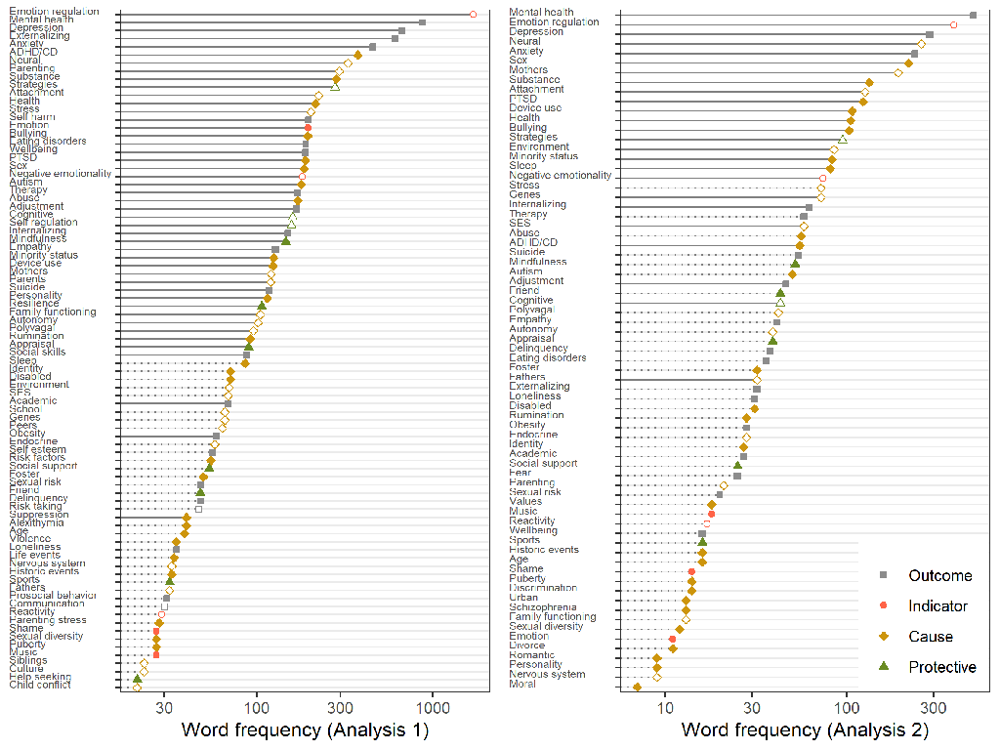

```{r setup, include=FALSE}
#css: https://maxcdn.bootstrapcdn.com/bootstrap/3.3.7/css/bootstrap.min.css
knitr::opts_chunk$set(echo = FALSE)
```

## Emotion regulation in adolescence
  
Developmentally sensitive period for emotion regulation [@zimmermannEmotionRegulationEarly2014]

20% develop psychopathology [@leeAdolescentMentalHealth2014]

Potentially lifelong implications for mental health and well-being

What phenomena are associated with adolescents' emotion regulation?

## Knowledge gap

Substantial empirical research has addressed this topic, but:

* Different (sub)disciplines have approached the topic in disparate ways [@riedigerEmotionRegulationAdolescence2014]
* No consistent terminology [@bariolaChildAdolescentEmotion2011]
* No conceptual frameworks [@stifterEmotionRegulation2019]
* No overarching theoretical framework [@bussTheoriesEmotionalDevelopment2019]

Knowledge across research areas must be integrated and consolidated into overarching theory.

## Moving forward

First step in *Theory Construction Methods* is identifying relevant phenomena [@borsboomTheoryConstructionMethodology2020]

* Phenomena: stable and general features of the world

Few tools for identifying relevant phenomena
    
* aside from expert opinion

*Text mining systematic reviews are a suitable and relatively objective method for phenomena detection.*

## Why text mining?

**Narrative reviews:** small samples, confirmation bias, emphasis on positive results [@littellEvidencebasedBiasedQuality2008]

**Text mining systematic review (TMSR):**

* No limit on sample size
* Transparent, objective, reproducible process
* Assumes that *term frequency indicates relevance* of phenomena
* Assumes that *co-occurrence frequency indicates association*
    + Co-occurrence graph ~= rudimentary nomological network
    
## Baseline

Manual selection of key constructs from relevant theory and prior reviews [ @bariolaChildAdolescentEmotion2011; @coe-odessEmergentEmotionsAdolescence2019]:

* Bioecological model [@bronfenbrennerBioecologicalModelHuman2007]
* Transactional model [@sameroffUnifiedTheoryDevelopment2010]
* Hall's notion of "storm and stress"
* Theory of normative emotional development [@sroufeEmotionalDevelopmentOrganization1995]
* Tripartite model [@morrisRoleFamilyContext2007]
* Internalization model [@holodynskiDevelopmentEmotionsEmotion2006]
* Polyvagal theory [@porgesOrientingDefensiveWorld1995].
* Model of social-affective engagement and goal flexibility [@croneUnderstandingAdolescencePeriod2012]
* Process model of emotion regulation [@grossHandbookEmotionRegulation2013]
* Social Information Processing Theory [@lemeriseIntegratedModelEmotion2000]


## Baseline network

```{r figbaseline, warning=FALSE, eval = TRUE, results='asis', out.width = "90%", fig.cap="Phenomena relevant to adolescents' emotion regulation according to theory (a) and narrative reviews (b; transparent nodes indicate constructs also present in the theory)."}
knitr::include_graphics("baseline_network.png") 
```

(a) Theory (b) narrative reviews; transparent nodes indicate constructs also present in theory.


## Limitations of relevant theory

* Few explicitly address adolescence
* Few comprehensively address predictors of emotion regulation
* None directly guide contemporary research 
* Theories vary widely in scope: Some are broad and non-specific; others describe a specific phenomenon in detail, but lack a broader perspective.
    + Broad theories can frame any research, specific theories generate hypotheses.
    + It would be beneficial to bridge these levels of analysis.


# Methods

## Open science

All code and data available at <https://github.com/cjvanlissa/veni_sysrev>

Workflow for Open Reproducible Code in Science (WORCS) used to make analyses reproducible [@vanlissaWORCSWorkflowOpen2020]


## Search strategy

Based on procedures by Staaks [@staaksSystematicReviewSearch2019]

Web of Science

Reference set of 29 articles

Search string constructed to retrieve this set (synonyms of emotion regulation and adolescence)

6653 results including 25 of the reference set

## Screening

```{r prismachart, eval = TRUE, results='asis', out.width = "80%"}

knitr::include_graphics("prismachart.png")
```

Addresses **emotion regulation** in population overlapping with age range [10-24]

# Method

## Analysis 1: Author keywords

* Extract author keywords
* Exclude methodological terms etc: 5031 documents with 8080 terms
* Dictionary of 108 terms with 464 regular expression queries
* Remaining unique terms: 5292
* Pruned terms exceeding $97.5^{th}$ percentile of negative binomial distribution (= 21+ documents)
* Most pruned terms (4004) occurred only once
* 2498 term co-occurrence relationships
* Pruned using negative binomial (25+ documents)

Final data: **4827 documents** with **84 terms** and **106 co-occurrence relationships**

Categorized causes, outcomes, protective factors, and indicators

## Analysis 2: Abstract text mining

* Selected nouns and adjectives using "part-of-speech tagging"
* Stemmed terms to their root
* Identified trigrams using `textrank` [@wijffelsTextrankSummarizeText2019]
* 5097 documents with 11448 unique words
* Pruned $97.5^{th}$ percentile (6+ documents)
* 850 co-occurrence relationships
* Pruned $97.5^{th}$ percentile (10+ documents)

Final data: **3096 documents** with **71** and **43 co-occurrence relationships**

<!-- ## Common terms 

```{r varimps1, eval = TRUE, results='asis', out.width = "90%"}

```

Author keywords (a) and abstracts (b)-->

## {.fullslide}


## Co-occurrence graph


```{r networks1, eval = TRUE, results='asis', out.width = "90%"}
knitr::include_graphics("tmnetworks_small.png")
```

Author keywords (a) and abstracts (b)

<!--## {.fullslide}

-->


## Results

* Both analyses reflected some constructs from theoretical literature
    + Particularly related to neurodevelopment and socialization
* Mental health-related outcomes feature prominently
    + Emotion regulation implicated in mental health problems [@leeAdolescentMentalHealth2014],
    + This underlines the importance of research in this area
* Substantial correspondence between keywords and abstracts, suggesting validity of method
* Networks are sparse; few connections among constructs: fragmented literature

## Undertheorized themes

* Developmental disorders
* Physical health (sic)
* External stressors
* Structural disadvantage
* Addictive behavior
* Identity and moral development
* Sexual development

## Implications

* Empirical research relies on theory; under-theorized phenomena may be overlooked
    + This study offers guidance for phenomena to consider as confounders/causes
* Unembedded terms indicate promising areas of future research
* Present study serves as starting point for theory development

## Stengths

* More comprehensive than previous narrative reviews [cf. @bariolaChildAdolescentEmotion2011; @coe-odessEmergentEmotionsAdolescence2019]
    + Used systematic search and included much larger corpus
* TMSR can process samples of any size, derive insights by transparent and reproducible procedures    

## Limitations

* These techniques do not extract *meaning* from the literature
* No access to full text articles (paywalls)
* Subjective decisions in analysis process [@wagenmakersCreativityVerificationCyclePsychological2018]

## Conclusion

Text mining systematic reviews can complement theory and narrative reviews

* Identify (undertheorized) relevant phenomena
* Map potential associations

Future theoretical work should integrate undertheorized themes into an overarching framework

Empirical research might consider them as promising areas for future research, or potential confounders and contributing causes


## References