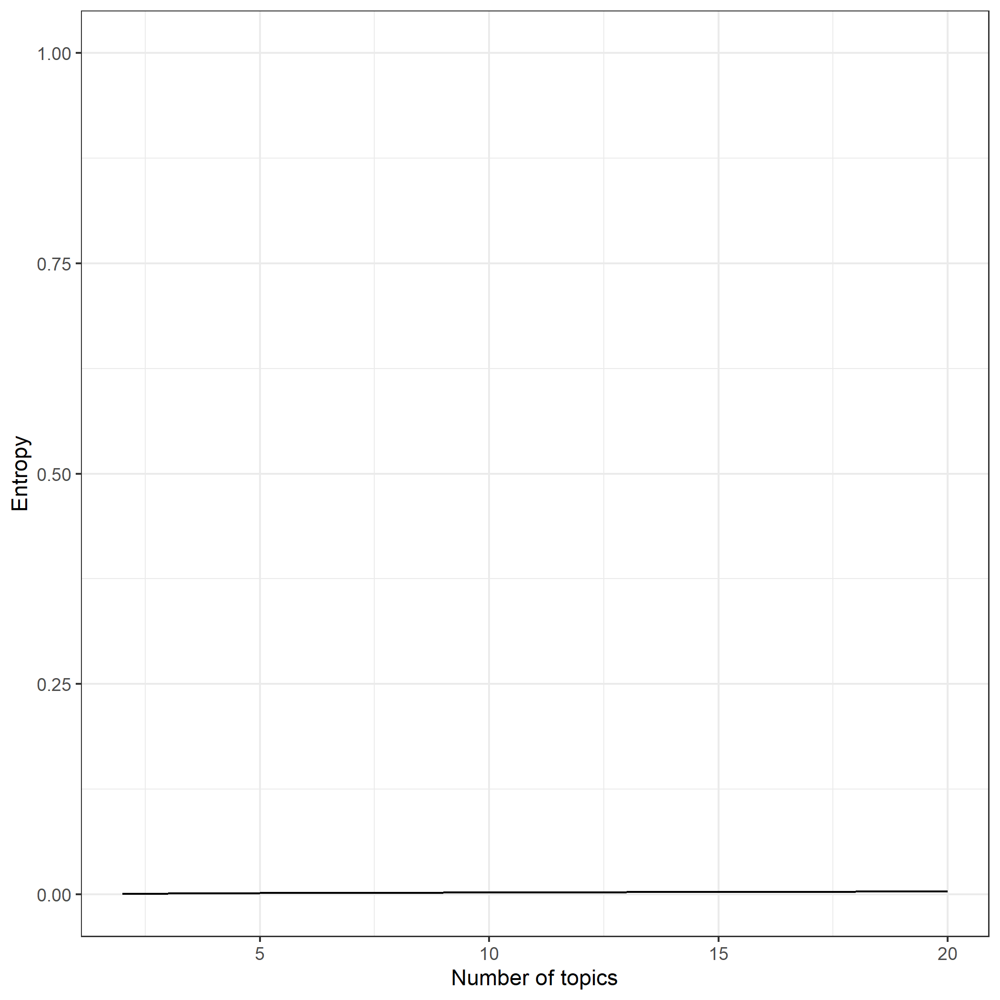
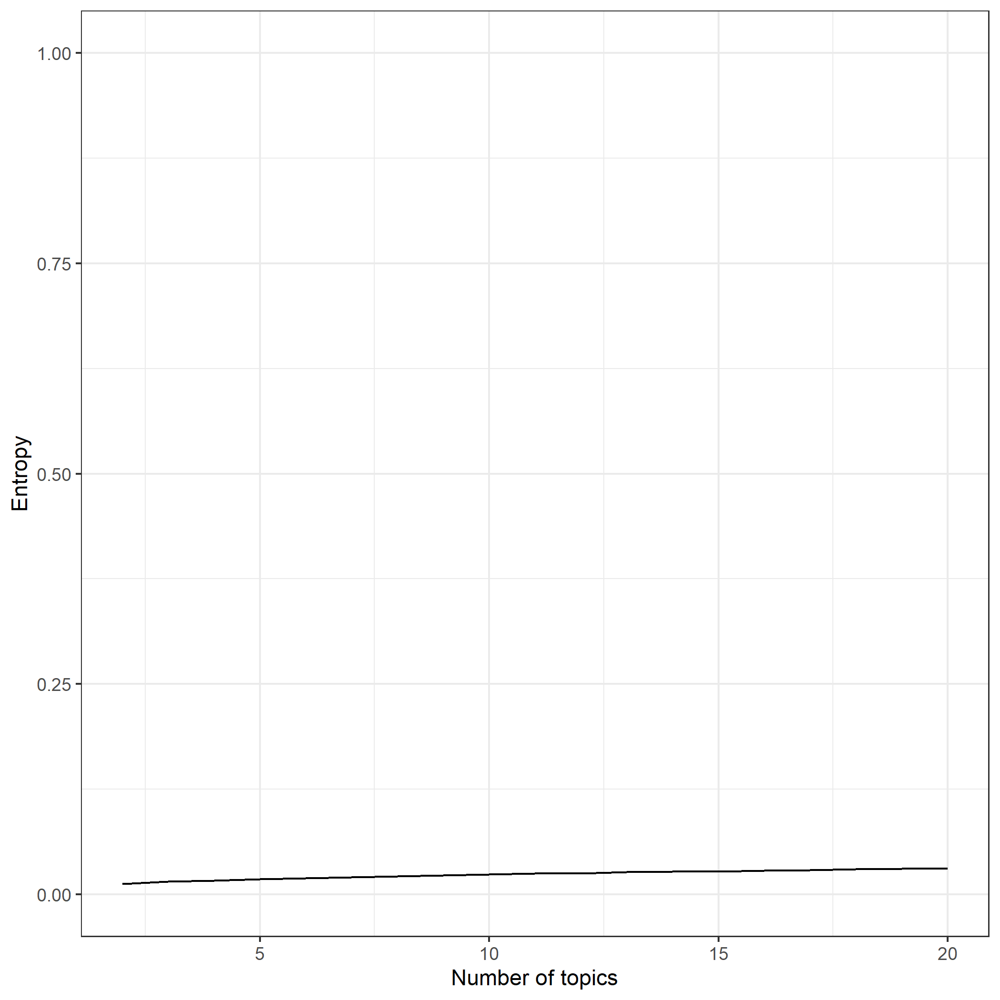

```{r setup, include=FALSE}
library(yaml)
knitr::opts_chunk$set(echo = FALSE)
lda_dims <- read_yaml("Study1_lda_dims.txt")
dtm_top <- read_yaml("study1_dtm_top.yml")
df <- readRDS("study1_df.RData")
number_docs_words <- yaml::read_yaml("study1_number_docs_words.txt")
```

This document describes a supplementary analysis related to the studies
described in the document `manuscript.Rmd`.

## Analysis 1: Author keywords

One important step in reviewing the literature is to examine heterogeneity of the corpus;
to analyze empirically whether there is, for example, a clear divide between psychiatric and developmental texts.
To this end, we conducted topic modeling using latent dirichlet allocation [@bleiLatentDirichletAllocation2003].
This is a clustering method for large sparse matrices.

The corpus for this first analysis consisted of author-provided keywords.
We extracted keywords by document, and applied an exclusion filter of methodological terms and similar non-substantive words.
The resulting corpus consisted of `r number_docs_words[1]` documents with `r number_docs_words[2]` unique terms.

We used the term frequency/inverse document frequency (TF-IDF) to select terms
used frequently in a document, but not used frequently in the corpus,
which could therefore be more diagnostic of subgroup membership.
Selection terms with an TF-IDF greater than the median resulted in a corpus of `r lda_dims[1]` documents and `r lda_dims[2]` terms.

We considered a range from 2-20 topics, evaluating fit based on the BIC, and interpretability based on the entropy of the posterior document/topic probabilities.
As can be seen in Figure \@ref(fig:figbic), the BICs followed a near-perfect linearly increasing trend, and the simplest model had the lowest BIC, indicating that no subcorpora could be identified.

```{r figbic, fig.cap="Analysis 1: Bayesian Information Criteria (BIC) for LDA models with 2-20 clusters."}
knitr::include_graphics("study1_BIC.png")
```
Congruently, all entropies were near-zero, as seen in Figure \@ref(fig:figent). 
Entropy reflects the separability of the extracted clusters.
The low entropies observed in this analysis indicate that the posterior document/topic probabilities were effectively uniformly distributed.
Thus, no subcorpora could be identified,
and we proceeded with an analysis of the whole sample.

```{r figent, fig.cap="Analysis 1: Entropy values for LDA models with 2-20 clusters."}

```

## Analysis 2: Abstracts

```{r, warning=FALSE, message=FALSE}
lda_dims_2 <- read_yaml("Study2_lda_dims.txt")
```
The corpus for this second analysis consisted of the abstracts of the selected articles.
To perform feature extraction,
we first applied the natural language processing technique "part-of-speech tagging" (POS-tagging), which identifies a word's grammatical function within the sentence context.
Because our analysis sought to identify phenomena,
we retained only nouns (to capture terms like "emotion") and adjectives (to capture the "mental" in "mental health").
Retaining nouns and adjectives generally helps derive more interpretable text mining models [@martinMoreEfficientTopic2015].
Finally, we used stemming to reduce the retained terms to their root form.
The resulting corpus consisted of 15587 terms in 4414 documents.

To assess the homogeneity of the corpus of abstracts,
we again conducted topic modeling.
We selected terms with an TF-IDF greater than the median, which resulted in a corpus of `r lda_dims_2[2]` terms in `r lda_dims_2[1]` documents.

We considered a range from 2-20 topics, evaluating fit based on the BIC, and interpretability based on the entropy of the posterior document/topic probabilities.
As can be seen in Figure \@ref(fig:figbic2), the BICs again followed a near-perfect linearly increasing trend, and the simplest model had the lowest BIC, indicating that no subcorpora could be identified.

```{r figbic2, fig.cap="Analysis 2: Bayesian Information Criteria (BIC) for LDA models with 2-20 clusters."}
knitr::include_graphics("study2_BIC.png")
```

Congruently, all entropies were near-zero, as seen in Figure \@ref(fig:figent2). 
Entropy reflects the separability of the extracted clusters.
The low entropies observed in this analysis indicate that the posterior document/topic probabilities were effectively uniformly distributed.
Thus, no subcorpora could be identified,
and we proceeded with an analysis of the whole sample.

```{r figent2, fig.cap="Analysis 2: Entropy values for LDA models with 2-20 clusters."}

```

As before, the BICs followed a linearly increasing trend, and entropies were near-zero.
Thus, no subcorpora were identified,
and we proceed with a whole sample analysis.

# References
